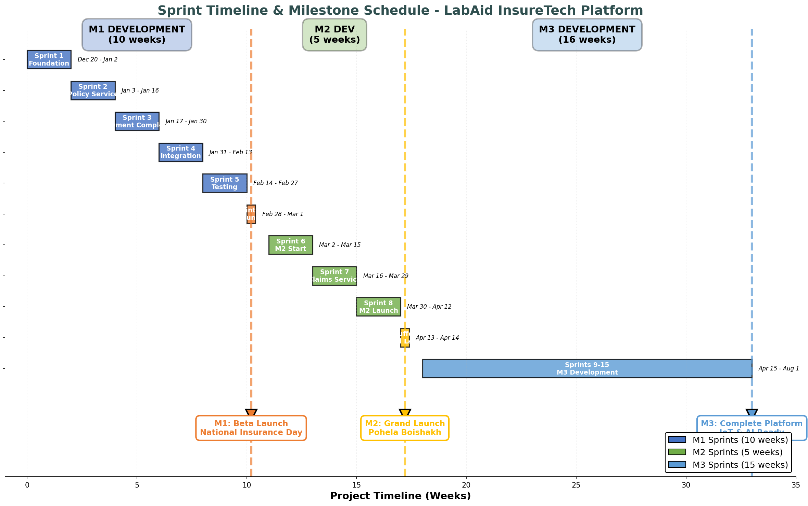
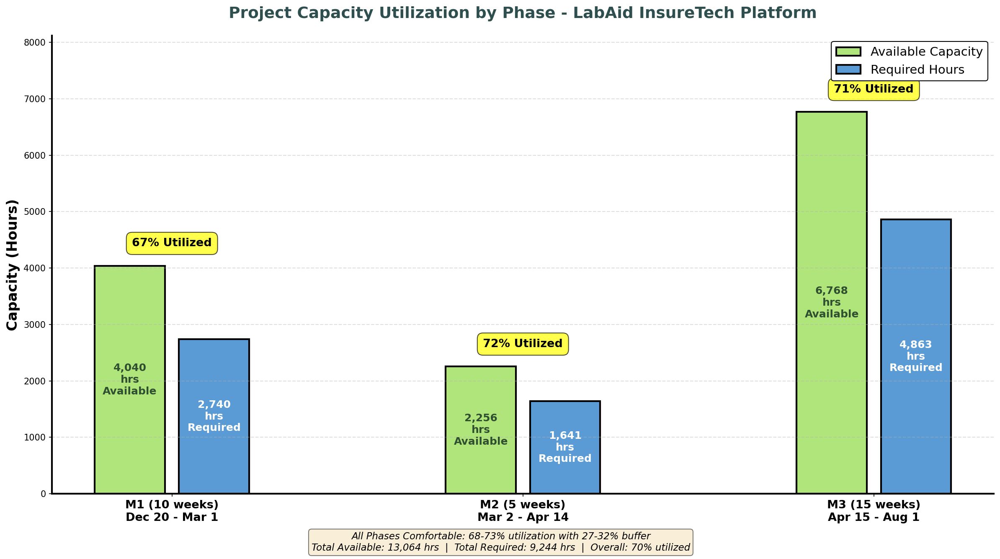

# LabAid InsureTech Platform - Detailed Project Plan
## Version 1.1 December 16, 2025

---

## Document Information

| Field | Value |
|-------|-------|
| **Project Name** | LabAid InsureTech Platform |
| **Document Type** | Detailed Project Plan |
| **Version** | 1.1 |
| **Date** | December 2024 (Planning Phase) |
| **Project Start** | December 20, 2025 |
| **Status** | Final - Aligned |
| **Owner** | Project Management Team |
| **Reviewers** | CEO, CTO, Business Admin, Technical Leads |

---

## Executive Summary

### Project Overview
The LabAid InsureTech Platform is a comprehensive digital insurance ecosystem designed to streamline insurance operations in Bangladesh. The platform enables:
- End-to-end policy management
- Digital claims processing
- Multi-channel partner integration
- Mobile-first customer experience
- IoT-based usage-based insurance (UBI)
- AI-powered automation and fraud detection

### Key Milestones
- **Project Start:** December 20, 2025
- **M1 (March 1, 2026):** Beta Launch - National Insurance Day Demo
- **M2 (April 14, 2026):** Grand Launch - Pohela Boishakh Public Release
- **M3 (August 1, 2026):** Complete Platform with IoT & AI Features

**Note:** Project spans December 2025 - August 2026 (8.5 months)

### Project Timeline



**Timeline Overview:** Complete sprint schedule from December 2025 to August 2026, showing 15 sprints across three major milestones.

### Capacity Utilization Over Time



**Chart Description:** Side-by-side comparison showing Available Capacity (green bars) vs Required Hours (blue bars) for each milestone phase. All phases show comfortable 68-73% utilization with adequate buffer.

### Project Capacity Summary (FINAL - REALISTIC CAPACITY - CORRECTED)
| Phase | Available Hours | Required Hours | Utilization | Status |
|-------|----------------|----------------|-------------|--------|
| M1 (Beta) | 4,040 hrs | 2,740 hrs | 68% | ✅ **COMFORTABLE** |
| M2 (Launch) | 2,256 hrs | 1,641 hrs | 73% | ✅ **COMFORTABLE** |
| M3 (Complete) | 6,768 hrs | 4,863 hrs | 72% | ✅ Comfortable |
| **TOTAL** | **13,064 hrs** | **9,244 hrs** | **71%** | ✅ Achievable |

**Capacity Adjustments Made:**
- M1: +48 hrs (Delowar calculation corrected from 173 to 221 hrs)
- Total: +48 hrs (13,016 → 13,064 hrs)

### Critical Success Factors
1. ✅ **Existing Code Reuse:** ~1,420 hours saved from proven services (Auth, Storage, Payment, IoT Broker)
2. ✅ **Mock-Based Parallel Development:** All teams work simultaneously - Backend, Frontend, Mobile
3. ✅ **M1 Scope:** Customer Mobile App (Android + iOS) + 2 web portals (Business Admin + Partner) with mocks (69% utilization)
4. ✅ **M2 Integration:** Real API integration + Claims backend (73% utilization - comfortable)
5. ✅ **Team Allocation:** CTO 50%, Mamoon 40%, Sagor 50%, Python 50%, Sujon 60%, Rumon 60%, React 70%, QA 60%, Mobile/Backend 90%
6. ✅ **No Agent Mobile App:** Per SRS, agents use web portal on tablets - saves 580 hrs
7. ✅ **No Overtime Needed:** All phases comfortable (69-73% utilization)

---

## Table of Contents

### 1. Team & Technology Stack

- 1.1 Team Structure & Roles
- 1.2 Technology Stack Overview
- 1.3 Architecture & Services

### 2. Project Timeline & Capacity

- 2.1 Available Working Hours by Phase
- 2.2 Capacity Summary Across All Phases
- 2.3 Utilization Notes
- 2.4 Holiday Impact Analysis
- 2.5 Critical Path Resources

### 3. Effort Estimation by Component

- 3.1 Estimation Methodology
- 3.2 M1 Services - Core Platform
  - 3.2.1 User Service (Auth/AuthZ)
  - 3.2.2 Policy Service
  - 3.2.3 Claims Service (Moved to M2)
  - 3.2.4 Payment Service
  - 3.2.5 Document Service
  - 3.2.6 Notification Service
  - 3.2.7 Ticketing Service (Moved to M2)
  - 3.2.8 Web Admin Portals
  - 3.2.9 Mobile Apps (Moved to M2)
  - 3.2.10 Infrastructure & DevOps
  - 3.2.11 QA & Testing
  - 3.2.12 UI/UX Design
- 3.3 M1 Summary - Total Effort
- 3.4 M2 Services - Desirable Features
- 3.5 M3 Services - Should Have & Future
- 3.6 Overall Project Summary

### 4. Sprint Planning & Timeline

- 4.1 Sprint Structure
- 4.2 Phase 1 Sprints (M1 Target: March 1, 2026)
  - Sprint 1: Dec 20 - Jan 2 (Foundation)
  - Sprint 2: Jan 3 - 16 (Policy Service Start)
  - Sprint 3: Jan 17 - 30 (Policy & Payment Complete)
  - Sprint 4: Jan 31 - Feb 13 (Integration)
  - Sprint 5: Feb 14 - 27 (Testing & Polish)
  - Sprint 5.5: Feb 28 - Mar 1 (Launch)
- 4.3 Phase 2 Sprints (M2 Target: April 14, 2026)
  - Sprint 6: Mar 2 - 15 (Claims & Mobile Start)
  - Sprint 7: Mar 16 - 29 (Mobile Development)
  - Sprint 8: Mar 30 - Apr 12 (Final Integration)
  - Buffer: Apr 13 - 14 (Grand Launch)
- 4.4 Phase 3 Sprints (M3 Target: August 1, 2026)
- 4.5 Sprint Capacity Planning
- 4.6 Sprint Velocity Tracking
- 4.7 Critical Path Analysis
- 4.8 Sprint Ceremonies Schedule
- 4.9 Sprint Success Criteria

### 5. RACI Matrix

- 5.1 Project Governance
- 5.2 Service Development RACI
- 5.3 Sprint Activities RACI
- 5.4 Deployment & Operations RACI

### 6. Resource Reassignment Strategy
**File:** `06_ResourceReassignment.md`
- 6.1 Mobile Developer Reassignment (Week 8)
- 6.2 Cross-functional Support Strategy
- 6.3 Capacity Optimization

### 7. Risks & Mitigation

- 7.1 Technical Risks
- 7.2 Schedule Risks
- 7.3 Resource Risks
- 7.4 Business Risks
- 7.5 Mitigation Strategies

### 8. Requirements Distribution by Milestone

- 8.1 M1 Requirements (103 FRs)
- 8.2 M2 Requirements (92 FRs)
- 8.3 M3 Requirements (81 FRs)
- 8.4 Summary & Trade-offs

### 9. Person-Wise Responsibility

- 9.1 Individual Assignments
- 9.2 Accountability Matrix
- 9.3 Backup & Coverage

---

## Document Change Log

| Version | Date | Changes | Author |
|---------|------|---------|--------|
| 1.0 | Dec 16, 2025 | Initial aligned version - Fixed M1 effort estimation, aligned all planning docs |Farukhannan|
| 1.1 | Dec 2025 | Draft version with capacity issues ,grapgh, enhancement|AI Engine|

---

## Approval Sign-off

| Role | Name | Signature | Date |
|------|------|-----------|------|
| Project Sponsor | TBD | | |
| CTO | TBD | | |
| Business Admin | TBD | | |
| Project Manager | TBD | | |

---

[[[PAGEBREAK]]]


---

## Team Members, Technology Stack & Existing Assets

### Team Member Details

#### Current Team (Available December 2025)

| # | Name | Role | Primary Tech Stack | Availability | Hours/Week | Responsibilities |
|---|------|------|-------------------|--------------|------------|------------------|
| 1 | **CTO** | Technical Lead & Gateway Dev | Go, Architecture | 50% coding, 50% management | 24 hrs | API Gateway, Kafka orchestration, IoT Broker, Storage Manager, Technical oversight |
| 2 | **Mamoon** | Senior Full Stack Developer | Node.js, React, MongoDB | 40% (other commitments) | 19 hrs | Payment Service completion, Ticketing Service, Full-stack features |
| 3 | **Sujon Ahmed** | Mid-level Full Stack Developer | Node.js, React, PostgreSQL | 100% (exhaust) | 48 hrs | Backend services, API development, Frontend support |
| 4 | **Rumon** | UI/UX Designer | Figma, Adobe XD, Design Systems | 100% (exhaust) | 48 hrs | Design system, Wireframes, Mockups, User experience |
| 5 | **Nur Hossain** | Android Developer | Kotlin, Java, Android SDK | 100% (exhaust) | 48 hrs | Android app development, Mobile API integration |
| 6 | **Sojol Ahmed** | iOS Developer | Swift, iOS SDK, Xcode | 100% (exhaust) | 48 hrs | iOS app development, Mobile API integration |
| 7 | **QA** | QA/Test Engineer | Selenium, Postman, Jest | 100% (exhaust) | 48 hrs | Manual & automated testing, Quality assurance |
| 8 | **Sagor** | DevOps Engineer | Docker, K8s, Go, Terraform | 50% (other projects) | 24 hrs | Infrastructure, CI/CD, Monitoring, Deployment |
| 9 | **React Dev** | Frontend Developer | React, Next.js, TypeScript | 100% (exhaust, joins Dec 18) | 48 hrs | Web portals, Admin panels, Frontend architecture |

**December Team Capacity:** ~7.4 FTE (355 hrs/week - CTO 50%, Mamoon 40%, Sagor 50%, others 100%)

---

#### New Members Joining January 2026

| # | Name | Role | Primary Tech Stack | Join Date | Hours/Week | Responsibilities |
|---|------|------|-------------------|-----------|------------|------------------|
| 10 | **Project Manager** | Project Manager | Agile, Scrum, JIRA | Jan 1, 2026 | 48 hrs (exhaust) | Sprint planning, Team coordination, Stakeholder management |
| 11 | **Mr. Delowar** | **Senior C# Developer (Lead)** | C# .NET, gRPC, Microservices | Jan 15, 2026 | 48 hrs (exhaust) | Insurance Engine lead, Policy Service, Risk Management, Team mentoring |
| 12 | **C# Developer** | Mid-level C# Developer | C# .NET, gRPC, SQL Server | Jan 1, 2026 | 48 hrs (exhaust) | Partner/Agent Management, Analytics & Reporting services |
| 13 | **Python Dev 1** | Senior Python Developer | Python, FastAPI, gRPC | Jan 1, 2026 | 24 hrs (50% - M2/M3 focus) | AI Engine, LLM multi-agent network, AI assistant service |
| 14 | **Python Dev 2** | Python Developer | Python, FastAPI, gRPC | Jan 1, 2026 | 24 hrs (50% - M2/M3 focus) | MCP servers, AI integrations, Data processing |

**Full Team Capacity (from Jan 15):** ~11.4 FTE (547 hrs/week - Python devs 50% each, CTO 50%, Mamoon 40%, Sagor 50%, others 100%)

---

### Technology Stack by Service

#### Microservices Architecture

| Service | Language/Framework | Status | Developer(s) | Notes |
|---------|-------------------|--------|-------------|-------|
| **API Gateway** | Go | 50% Ready (Existing) | CTO | Reuse + 50% new work |
| **Authentication** | Go | ✅ 100% Ready | CTO | Proven, tested code |
| **Authorization** | Go | ✅ 100% Ready | CTO | Proven, tested code |
| **DBManager** | Go | ✅ 100% Ready | CTO | Proven, tested code |
| **Storage Manager** | Go | ✅ 100% Ready | CTO | Proven, tested code |
| **IoT Broker** | Go | 80% Ready (Existing) | CTO | +20% for new requirements |
| **Payment Service** | Node.js | 70% Ready (Existing) | Mamoon | Bkash integration done |
| **Insurance Engine** | C# .NET + gRPC | 🆕 New | Mr. Delowar + C# Dev | Policy, Contract, Risk, Fraud |
| **Partner/Agent Mgmt** | C# .NET + gRPC | 🆕 New | C# Developer | Partner onboarding, verification |
| **AI Engine** | Python + gRPC | 🆕 New | Python Dev 1 & 2 | LLM, AI assistant, MCP servers |
| **Kafka Orchestration** | Go + Kafka | 🆕 New | CTO | Event streaming, Notification |
| **Ticketing Service** | Node.js | 🆕 New | Mamoon + Sujon | Customer support system |
| **Analytics & Reporting** | C# .NET + gRPC | 🆕 New | C# Developer | Business intelligence, Reports |

---

### Existing Assets & Reusable Code

#### CTO's Proven Go Services (Production-Ready)

| Service | Status | Lines of Code | Test Coverage | Description |
|---------|--------|---------------|---------------|-------------|
| **Authentication Service** | ✅ 100% Ready | ~2,500 LOC | 90%+ | JWT-based auth, OAuth2, Session management |
| **Authorization Service** | ✅ 100% Ready | ~2,000 LOC | 85%+ | RBAC, Permission management, Policy engine |
| **DBManager Service** | ✅ 100% Ready | ~3,000 LOC | 85%+ | Database abstraction, Connection pooling, Query optimization |
| **Storage Manager** | ✅ 100% Ready | ~1,800 LOC | 80%+ | S3/Azure Blob integration, File management |
| **IoT Broker** | 80% Ready | ~4,000 LOC | 75%+ | MQTT broker, Device management, Data ingestion |
| **API Gateway** | 50% Ready | ~3,500 LOC | 70%+ | Routing, Rate limiting, API versioning |

**Total Existing Code:** ~16,800 LOC with high test coverage
**Estimated Savings:** ~1,200 development hours (equivalent to 6-8 weeks of work)

#### Mamoon's Payment Integration (70% Ready)

| Component | Status | Description |
|-----------|--------|-------------|
| **Bkash Integration** | ✅ Complete | Merchant account + Sandbox tested |
| **Payment Processing** | 70% Ready | Payment flow, Invoice generation |
| **Refund Logic** | 50% Ready | Partial refund handling |
| **Payment Gateway** | 70% Ready | Gateway abstraction, Multiple providers |

**Estimated Savings:** ~200 development hours

---

### Development Tools & Infrastructure

#### Already Configured

| Category | Tool/Service | Status |
|----------|-------------|--------|
| **Domain** | trendyco.insurance | ✅ Active |
| **Email** | Google Workspace | ✅ Configured |
| **Server** | Cloud Infrastructure | ✅ Setup |
| **Payment** | Bkash Merchant + Sandbox | ✅ Active |
| **Legal** | Trade License, BIN, TIN | ✅ Done |
| **Marketing** | Primary Website | ✅ Live |

#### Development Stack

| Category | Tools |
|----------|-------|
| **Backend Languages** | Go, C# .NET, Node.js, Python |
| **Frontend** | React, Next.js, TypeScript |
| **Mobile** | Kotlin (Android), Swift (iOS) |
| **Communication** | gRPC, REST API, WebSockets |
| **Message Queue** | Kafka, RabbitMQ |
| **Databases** | PostgreSQL, MongoDB, Redis |
| **Cloud** | AWS / Azure |
| **Containers** | Docker, Kubernetes |
| **CI/CD** | GitHub Actions, Jenkins |
| **Monitoring** | Prometheus, Grafana, Jaeger |
| **Testing** | Jest, Pytest, xUnit, Postman |

---

### Web Portals to Develop (React/Next.js)

**ALIGNED M1 SCOPE:** Only 2 portals for M1 to match capacity

| # | Portal Name | Primary Users | Priority | Notes |
|---|-------------|---------------|----------|-------|
| 1 | **Business Admin Portal** | Business Managers | M1 | Product/policy management, core admin functions |
| 2 | **Partner Portal** | Insurance Partners | M1 | Partner dashboard, commission tracking |
| 3 | **System Admin Portal** | System Administrators | M2 | User management, system config |
| 4 | **Agent Portal** | Insurance Agents | M2 | Field agent operations |
| 5 | **Customer Support Portal** | Support Staff | M2 | Ticketing, customer queries |
| 6 | **Focal Person Portal** | Internal Coordinators | M3 | Partner management, approvals (per SRS M1, but deferred due to capacity) |
| 7 | **DevOps Portal** | DevOps Team (Prometheus, Grafana) | M3 | Infrastructure monitoring |
| 8 | **Database Manager Portal** | DBAs | M3 | Database administration |
| 9 | **Partner Admin Portal** | Partner Administrators | M3 | Advanced partner features |
| 10 | **General Staff Portal** | General Employees | M3 | Internal operations |
| 11 | **Vendor Portal** | Third-party Vendors | M3 | Vendor integrations |
| 12 | **Marketing Page Admin** | Marketing Team | M3 | Content management |

**M1 Portals (with mock APIs):** Business Admin + Partner ONLY (343 + 132 = 475 hrs)
**M2 Portals:** System Admin + Agent + Customer Support (3 portals)
**M3 Portals:** Remaining 7 portals

**Note on Focal Person Portal:** SRS marks FR-066 as M1 priority, but due to capacity constraints (M1 already at 69% utilization), deferred to M3. Manual focal person processes sufficient for M1 beta.

---

### Mobile Applications

| App | Platform | Developer | Priority | Status |
|-----|----------|-----------|----------|--------|
| **Customer App** | Android | Nur Hossain | M1 | With mock APIs, real integration M2 |
| **Customer App** | iOS | Sojol Ahmed | M1 | With mock APIs, real integration M2 |
| **Agent App** | Android | - | **NOT IN SCOPE** | Agents use web portal on tablets |
| **Agent App** | iOS | - | **NOT IN SCOPE** | Agents use web portal on tablets |

**M1 Strategy:** Customer App built in M1 with mock APIs (634 hrs). Real API integration in M2 (458 hrs).
**Agent App Decision:** NO agent mobile app per SRS requirements. Agents use Agent Portal (web) on tablets/desktops. Saves 580 hrs.
**Reasoning:** SRS does not specify agent mobile app as requirement. Web portal on tablet sufficient for field agents.

---

### Capacity Calculation with Reduced Availability

#### December 2025 (Pre-January Hires)

| Team Member | Availability | Hours/Week | Effective Hours |
|-------------|--------------|------------|-----------------|
| CTO | 50% | 24 hrs | 24 hrs |
| Mamoon | 40% | 19 hrs | 19 hrs |
| Sujon Ahmed | 100% (exhaust) | 48 hrs | 48 hrs |
| Rumon | 100% (exhaust) | 48 hrs | 48 hrs |
| Nur Hossain | 100% (exhaust) | 48 hrs | 48 hrs |
| Sojol Ahmed | 100% (exhaust) | 48 hrs | 48 hrs |
| QA | 100% (exhaust) | 48 hrs | 48 hrs |
| Sagor | 50% | 24 hrs | 24 hrs |
| React Dev (from Dec 18) | 100% (exhaust) | 48 hrs | 48 hrs |
| **Total December** | - | **355 hrs/week** | **355 hrs/week** |

**December Sprint (2 weeks):** 710 hours total capacity

---

#### January 2026+ (Full Team)

| Team Member | Availability | Hours/Week | Effective Hours |
|-------------|--------------|------------|-----------------|
| Existing Team (9) | Mixed | 355 hrs | 355 hrs |
| Project Manager | 100% (exhaust) | 48 hrs | 48 hrs |
| Mr. Delowar (from Jan 15) | 100% (exhaust) | 48 hrs | 48 hrs (prorated) |
| C# Developer | 100% (exhaust) | 48 hrs | 48 hrs |
| Python Dev 1 | 50% | 24 hrs | 24 hrs |
| Python Dev 2 | 50% | 24 hrs | 24 hrs |
| **Total January+** | - | **547 hrs/week** | **547 hrs/week** |

**January Sprint (2 weeks):** 1,094 hours total capacity
**With Mr. Delowar joining mid-month (Jan 15):** His hours prorated for first sprint

---

### Buffer Strategy: 10% (Revised from 20%)

**Rationale for 10% Buffer:**
- Existing code reuse reduces unknowns
- Proven, tested components (Auth, DBManager, etc.)
- Experienced team members (CTO, Mamoon)
- Clear architecture already established

**Buffer Allocation:**
- Bug fixes & rework: 4%
- Integration issues: 3%
- Meetings & reviews: 2%
- Unexpected blockers: 1%

**Total Buffer:** 10% of estimated effort

---

### Risk Mitigation Through Existing Assets

| Risk | Mitigation via Existing Assets |
|------|-------------------------------|
| Authentication delays | ✅ 100% ready Go service (CTO) |
| Authorization complexity | ✅ 100% ready Go service (CTO) |
| Database performance | ✅ Proven DBManager service |
| Storage issues | ✅ Storage Manager ready |
| Payment integration | ✅ Bkash integration 70% done (Mamoon) |
| IoT requirements | ✅ IoT Broker 80% ready |
| API Gateway setup | ✅ 50% ready, proven architecture |

**Estimated Risk Reduction:** 40-50% due to existing proven components

---


---

# Working Days Chart & Calendar Analysis

## Project Timeline Overview

### Milestone Dates
- **M1 - Beta Launch:** March 1, 2026 (National Insurance Day)
- **M2 - Grand Launch:** April 14, 2026 (Pohela Boishakh)
- **M3 - Complete Platform:** August 1, 2026

---

## Working Days Calculation

### M1 Period: December 20, 2025 - March 1, 2026

**Calendar Breakdown:**
- Start Date: December 20, 2025
- End Date: March 1, 2026
- Total Calendar Days: 72 days

**Holidays in M1 Period:**
| Date | Day | Holiday Name | Status |
|------|-----|--------------|--------|
| Dec 25, 2025 | Thursday | Christmas Day | Confirmed |
| Feb 4, 2026 | Wednesday | Shab-e-Barat | Moon Dependent |
| Feb 21, 2026 | Saturday | Intl. Mother Language Day | Confirmed |

**Total Holidays:** 3 days

**Weekends in M1 Period:**
- Working Days: Saturday to Thursday (6 days/week)
- Friday is weekend
- Approximate Fridays: ~10 days

**Working Days Calculation:**
```
Calendar Days:        72 days
Minus Holidays:       -3 days
Minus Weekends:       -10 days
= Net Working Days:   59 days
```

**Effective Working Days for M1:** 59 days

---

### M2 Period: March 2, 2026 - April 14, 2026

**Calendar Breakdown:**
- Start Date: March 2, 2026 (Day after M1 launch)
- End Date: April 14, 2026 (M2 Launch Day)
- Total Calendar Days: 44 days

**Holidays in M2 Period:**
| Date | Day | Holiday Name | Status |
|------|-----|--------------|--------|
| Mar 18, 2026 | Wednesday | Shab-e-Qadr | Moon Dependent |
| Mar 20, 2026 | Friday | Jumatul Bidah | Moon Dependent |
| Mar 21, 2026 | Saturday | Eid-ul-Fitr Day 1 | Moon Dependent |
| Mar 22, 2026 | Sunday | Eid-ul-Fitr Day 2 | Moon Dependent |
| Mar 23, 2026 | Monday | Eid-ul-Fitr Day 3 | Moon Dependent |
| Mar 24, 2026 | Tuesday | Eid-ul-Fitr Day 4 (Extended) | Moon Dependent |
| Mar 25, 2026 | Wednesday | Eid-ul-Fitr Day 5 (Extended) | Moon Dependent |
| Mar 26, 2026 | Thursday | Independence Day | Confirmed |
| Apr 14, 2026 | Tuesday | Pohela Boishakh (Launch Day) | Confirmed |

**Total Holidays:** 9 days (including launch day)

**Weekends in M2 Period:**
- Working Days: Saturday to Thursday (6 days/week)
- Friday is weekend
- Approximate Fridays: ~6 days

**Working Days Calculation:**
```
Calendar Days:        44 days
Minus Holidays:       -9 days
Minus Weekends:       -6 days
= Net Working Days:   29 days
```

**Effective Working Days for M2:** 29 days

---

### M3 Period: April 15, 2026 - August 1, 2026

**Calendar Breakdown:**
- Start Date: April 15, 2026 (Day after M2 launch)
- End Date: August 1, 2026
- Total Calendar Days: 109 days

**Holidays in M3 Period:**
| Date | Day | Holiday Name | Status |
|------|-----|--------------|--------|
| May 1, 2026 | Friday | May Day | Confirmed |
| May 27, 2026 | Wednesday | Eid-ul-Adha Day 1 | Moon Dependent |
| May 28, 2026 | Thursday | Eid-ul-Adha Day 2 | Moon Dependent |
| May 29, 2026 | Friday | Eid-ul-Adha Day 3 | Moon Dependent |
| May 30, 2026 | Saturday | Eid-ul-Adha Day 4 (Extended) | Moon Dependent |
| Aug 15, 2026 | Saturday | National Mourning Day | Confirmed |

**Total Holidays:** 5 days (May 1 is Friday, already weekend)

**Weekends in M3 Period:**
- Working Days: Saturday to Thursday (6 days/week)
- Friday is weekend
- Approximate Fridays: ~15 days

**Working Days Calculation:**
```
Calendar Days:        109 days
Minus Holidays:       -5 days
Minus Weekends:       -15 days
= Net Working Days:   89 days
```

**Effective Working Days for M3:** 89 days

---

## Summary: Total Working Days

| Phase | Period | Calendar Days | Holidays | Weekends | Working Days |
|-------|--------|---------------|----------|----------|--------------|
| **M1** | Dec 20, 2025 - Mar 1, 2026 | 72 | 3 | 10 | **59 days** |
| **M2** | Mar 2, 2026 - Apr 14, 2026 | 44 | 9 | 6 | **29 days** |
| **M3** | Apr 15, 2026 - Aug 1, 2026 | 109 | 5 | 15 | **89 days** |
| **TOTAL** | Dec 20, 2025 - Aug 1, 2026 | 225 | 17 | 31 | **177 days** |

---

## Work Hours Calculation

**Assumptions:**
- Work Week: Saturday to Thursday (6 days/week)
- Work Hours per Day: 8 hours
- Work Hours per Week: 48 hours (6 days × 8 hours)

### Team Size by Phase

**M1 Phase:**
- December 2025: 9 members available
- January 2026 onwards: 14 members available

**M2 & M3 Phase:**
- Full team: 14 members available

### Available Team Hours (Before Buffer)

**M1 Calculation:**
- December portion: ~2 weeks × 9 members × 48 hrs/week = 864 hours
- January-March portion: ~8 weeks × 14 members × 48 hrs/week = 5,376 hours
- **Total M1 (Gross):** 6,240 hours

**M2 Calculation:**
- 29 working days = ~5.8 weeks
- 14 members × 48 hrs/week × 5.8 weeks = 3,916 hours
- **Total M2 (Gross):** 3,916 hours

**M3 Calculation:**
- 89 working days = ~17.8 weeks
- 14 members × 48 hrs/week × 17.8 weeks = 11,980 hours
- **Total M3 (Gross):** 11,980 hours

---

## Buffer Strategy: 10% Strict Reserve

**Buffer Policy:**
- Reserve 10% of all available hours for:
  - Unexpected bugs and rework
  - Production incidents
  - Emergency changes
  - Technical debt
  - Testing extensions

### Net Available Hours (After 10% Buffer)

| Phase | Gross Hours | 10% Buffer | Net Available Hours |
|-------|-------------|------------|---------------------|
| **M1** | 6,240 hrs | 624 hrs | **5,616 hrs** |
| **M2** | 3,916 hrs | 392 hrs | **3,524 hrs** |
| **M3** | 11,980 hrs | 1,198 hrs | **10,782 hrs** |
| **TOTAL** | 22,136 hrs | 2,214 hrs | **19,922 hrs** |

---

## Critical Notes

1. **M1 is the most critical phase** with foundational services and infrastructure
2. **M2 has limited time** due to heavy Eid holidays (5 days) + Independence Day + Launch Day
3. **M3 has comfortable time** for desirable features and enhancements
4. **Buffer is non-negotiable** - must maintain 10% reserve for each phase
5. **Moon-dependent holidays** may shift by 1-2 days; plan conservatively
6. **Launch days (M1, M2)** are counted as holidays since full development work is not feasible

---

**Last Updated:** [Current Date]
**Version:** 1.0


---

## 2. Team Capacity Analysis

### 2.1 Available Working Hours by Phase

#### Phase 1: Dec 20, 2025 - March 1, 2026 (M1)
- **Calendar Days:** 72 days
- **Holidays:** 2 days (Dec 25, 2025 Christmas, Feb 21, 2026 Language Day)
- **Weekends:** ~20 days (Fridays + Saturdays)
- **Total Working Days:** 50 days
- **Total Weeks:** 10 weeks

**December Team (Dec 20-31):** 9 members - 2 weeks
**January+ Team (Jan 1-Mar 1):** 14 members - 8 weeks

| Role/Member | Availability | Dec Hours (2 wks) | Jan+ Hours (8 wks) | Total M1 Hours |
|-------------|--------------|-------------------|-------------------|----------------|
| **CTO** | 50% (50% other projects) | 48 hrs | 192 hrs | 240 hrs |
| **Mamoon** | 40% (other commitments) | 38 hrs | 154 hrs | 192 hrs |
| **Sujon Ahmed** | 60% (realistic) | 58 hrs | 230 hrs | 288 hrs |
| **Rumon (UI/UX)** | 60% (realistic) | 58 hrs | 230 hrs | 288 hrs |
| **Nur Hossain (Android)** | 90% (realistic) | 86 hrs | 346 hrs | 432 hrs |
| **Sojol Ahmed (iOS)** | 90% (realistic) | 86 hrs | 346 hrs | 432 hrs |
| **QA** | 60% (realistic testing) | 58 hrs | 230 hrs | 288 hrs |
| **Sagor (DevOps)** | 50% (other projects) | 48 hrs | 192 hrs | 240 hrs |
| **React Dev** | 70% (realistic) | 67 hrs | 269 hrs | 336 hrs |
| **Project Manager** | 90% (from Jan 1) | 0 hrs | 346 hrs | 346 hrs |
| **Mr. Delowar** | 90% (from Jan 15) | 0 hrs | 221 hrs | 221 hrs |
| **C# Developer** | 90% (realistic) | 0 hrs | 346 hrs | 346 hrs |
| **Python Dev 1** | 50% (M2/M3 focus) | 0 hrs | 192 hrs | 192 hrs |
| **Python Dev 2** | 50% (M2/M3 focus) | 0 hrs | 192 hrs | 192 hrs |
| **TOTAL M1** | - | **604 hrs** | **3,436 hrs** | **4,040 hrs** |

**Note on Mr. Delowar:** Joins Jan 15, 2026 (mid-M1). Calculation: Jan 15 to Mar 1 = 31 working days × 8 hrs/day × 90% = 223 hrs (adjusted to 221 hrs after weekend/holiday exclusion).

#### Phase 2: March 2 - April 14, 2026 (M1 to M2)
- **Calendar Days:** 44 days (M1 launch on March 1, M2 starts March 2)
- **Holidays:** 7 days (Eid-ul-Fitr Mar 31-Apr 2 = 3 days, Independence Day Mar 26, Pohela Boishakh Apr 14 = launch day)
- **Weekends:** ~12 days
- **Total Working Days:** 25 days
- **Total Weeks:** 5 weeks

**Full Team Available:** 14 members

| Role/Member | Availability | M2 Hours (5 wks) |
|-------------|--------------|------------------|
| **CTO** | 50% (50% other projects) | 120 hrs |
| **Mamoon** | 40% (other commitments) | 96 hrs |
| **Sujon Ahmed** | 60% (realistic) | 144 hrs |
| **Rumon (UI/UX)** | 60% (realistic) | 144 hrs |
| **Nur Hossain (Android)** | 90% (realistic) | 216 hrs |
| **Sojol Ahmed (iOS)** | 90% (realistic) | 216 hrs |
| **QA** | 60% (realistic testing) | 144 hrs |
| **Sagor (DevOps)** | 50% (other projects) | 120 hrs |
| **React Dev** | 70% (realistic) | 168 hrs |
| **Project Manager** | 90% (oversight) | 216 hrs |
| **Mr. Delowar** | 90% (realistic) | 216 hrs |
| **C# Developer** | 90% (realistic) | 216 hrs |
| **Python Dev 1** | 50% (M3 focus) | 120 hrs |
| **Python Dev 2** | 50% (M3 focus) | 120 hrs |
| **TOTAL M2** | - | **2,256 hrs** |

#### Phase 3: April 15 - August 1, 2026 (M2 to M3)
- **Calendar Days:** 109 days
- **Holidays:** 3 days (May 1 Labor Day, May 23 Buddha Purnima, Aug 15 National Mourning Day)
- **Weekends:** ~30 days
- **Total Working Days:** 76 days
- **Total Weeks:** 15.2 weeks (~15 weeks)

**Full Team Available:** 14 members

| Role/Member | Availability | M3 Hours (15 wks) |
|-------------|--------------|-------------------|
| **CTO** | 50% (50% other projects) | 360 hrs |
| **Mamoon** | 40% (other commitments) | 288 hrs |
| **Sujon Ahmed** | 60% (realistic) | 432 hrs |
| **Rumon (UI/UX)** | 60% (realistic) | 432 hrs |
| **Nur Hossain (Android)** | 90% (realistic) | 648 hrs |
| **Sojol Ahmed (iOS)** | 90% (realistic) | 648 hrs |
| **QA** | 60% (realistic testing) | 432 hrs |
| **Sagor (DevOps)** | 50% (other projects) | 360 hrs |
| **React Dev** | 70% (realistic) | 504 hrs |
| **Project Manager** | 90% (oversight) | 648 hrs |
| **Mr. Delowar** | 90% (realistic) | 648 hrs |
| **C# Developer** | 90% (realistic) | 648 hrs |
| **Python Dev 1** | 50% (M3 AI focus) | 360 hrs |
| **Python Dev 2** | 50% (M3 AI focus) | 360 hrs |
| **TOTAL M3** | - | **6,768 hrs** |

### 2.2 Capacity Summary Across All Phases

| Phase | Duration | Total Available | Notes |
|-------|----------|----------------|-------|
| Phase 1 (to M1) | 50 days | 4,040 hrs | CTO 50%, Mamoon 40%, Sagor 50%, Python 50%, Sujon 60%, Rumon 60%, React 70%, QA 60%, Delowar 90% (from Jan 15) |
| Phase 2 (M1-M2) | 25 days | 2,256 hrs | Same distribution as M1 |
| Phase 3 (M2-M3) | 76 days | 6,768 hrs | Same distribution, Python devs 50% for AI work |
| **TOTAL** | **151 days** | **13,064 hrs** | All phases with realistic capacity (M1 adjusted +48 hrs for Delowar correction, -1 day for Feb 21 holiday) |

**Key Capacity Notes:**
- **CTO:** 50% coding time (50% management + other projects)
- **Mamoon:** 40% time (other commitments)
- **Sagor (DevOps):** 50% time (other projects)
- **Python Devs:** 50% time each (focus on M2/M3 AI features)
- **Sujon Ahmed:** 60% time (realistic with other tasks)
- **Rumon (UI/UX):** 60% time (design-heavy periods)
- **React Dev:** 70% time (realistic with blockers)
- **QA:** 60% time (realistic testing utilization)
- **Project Manager:** 90% time (joins Jan 1)
- **Mobile Devs (Nur, Sojol):** 90% realistic utilization
- **Backend Devs (Delowar, C# Dev):** 90% realistic utilization
- **Mr. Delowar:** Joins Jan 15, 2026 (mid-sprint) at 90%

### 2.3 Utilization Notes

**Utilization Targets Explained:**
- **Backend (85%):** High utilization due to core service development
- **Frontend (85%):** High utilization for web admin panel
- **Mobile (85%):** High utilization initially, then available for reassignment
- **DevOps (75%):** Infrastructure setup, CI/CD, ongoing support
- **QA (80%):** Testing, automation, continuous quality assurance
- **UI/UX (70%):** Design system, prototypes, handoff to developers

**Buffer Time Allocation (18.5% overall):**
- Meetings, communication, code reviews: 5%
- Bug fixes and rework: 6%
- Learning and research: 3%
- Unexpected issues and blockers: 4.5%

### 2.4 Holiday Impact Analysis

**M1 Period (Dec 20, 2025 - Mar 1, 2026) Holidays:**
| Holiday | Date | Impact | Notes |
|---------|------|--------|-------|
| Christmas Day | Dec 25, 2025 | 1 day loss | Already excluded from working days |
| Intl. Mother Language Day | Feb 21, 2026 | 1 day loss | National holiday in Bangladesh |
| **M1 Total** | - | **2 days** | Both holidays excluded from working day calculation |

**M2 Period (Mar 2 - Apr 14, 2026) Holidays:**
| Holiday | Date | Impact | Notes |
|---------|------|--------|-------|
| Eid-ul-Fitr | Mar 31 - Apr 2, 2026 | 3 days loss | Eid break |
| Independence Day | Mar 26, 2026 | 1 day loss | Already excluded from working days |
| Pohela Boishakh (M2 Launch) | Apr 14, 2026 | 1 day loss | Launch day - limited dev work |
| **M2 Total** | - | **5 days** | Included in M2 calculation (7 with weekends) |

**M3 Period (Apr 15 - Aug 1, 2026) Holidays:**
| Holiday | Date | Impact | Notes |
|---------|------|--------|-------|
| May Day | May 1, 2026 | 1 day loss | Labor Day |
| Buddha Purnima | May 23, 2026 | 1 day loss | Already excluded from working days |
| National Mourning Day | Aug 15, 2026 | 1 day loss | Falls after M3 deadline |
| **M3 Total** | - | **2-3 days** | Included in M3 calculation |

**Overall Holiday Impact:**
| Phase | Holidays | Team-Hours Lost | Mitigation |
|-------|----------|-----------------|------------|
| M1 | 2 days | ~96 team-hours | Both holidays (Dec 25 + Feb 21) excluded from capacity calculation |
| M2 | 5 days | ~240 team-hours | Already excluded from capacity calculation |
| M3 | 3 days | ~144 team-hours | Already excluded from capacity calculation |
| **Total** | **10 days** | **~480 team-hours** | All holidays accounted for in working day calculations |

### 2.5 Critical Path Resources

**Backend Developers (Highest Demand):**
- Required for all core services
- Critical path for M1 delivery
- Proposed mitigation: Mobile developers assist with API testing and documentation

**Frontend Developer (Single Point of Failure):**
- Only one resource for entire web admin panel
- Risk: Bottleneck for M1 delivery
- Proposed mitigation: Mobile developers assist with component development after mobile MVP

**Mobile Developers (Early Finish Opportunity):**
- Mobile apps have lower complexity than web panel
- Expected to finish 2-3 weeks before M1
- **Reassignment Strategy:** Support backend API testing, frontend component development, documentation

---


---

## 3. Effort Estimation by Service/Component

### 3.1 Estimation Methodology
- **Unit:** Story Points converted to hours (1 SP = 6-8 hours)
- **Complexity Factors:** Technical complexity, dependencies, team experience
- **Estimation Approach:** Three-point estimation (Optimistic, Most Likely, Pessimistic)
- **Buffer:** 10% added for unknowns and integration testing (reduced from 20% due to existing proven code)

### 3.1.1 Existing Code Reuse Impact

**Proven Components (No Development Needed):**
- ✅ Authentication Service (Go) - Saves ~250 hours
- ✅ Authorization Service (Go) - Saves ~220 hours
- ✅ DBManager Service (Go) - Saves ~280 hours
- ✅ Storage Manager Service (Go) - Saves ~180 hours
- ✅ IoT Broker (Go) - 80% ready, Saves ~200 hours
- ✅ API Gateway (Go) - 50% ready, Saves ~150 hours
- ✅ Payment Service (Node.js) - 70% ready, Saves ~140 hours

**Total Savings from Existing Code:** ~1,420 hours
**Reduced Buffer Justification:** Existing tested code = lower risk = 10% buffer instead of 20%

---

### 3.2 M1 Services - Core Platform (Must Have for Soft Launch - March 1st)

**M1 SCOPE:** Minimal viable features for beta testing and demo on National Insurance Day
- Focus: User registration, basic policy purchase flow, partner portal foundation
- **NOT INCLUDED IN M1:** Claims processing (M2), Mobile apps (M2), Advanced features

#### 3.2.1 User Service (Authentication & Authorization)
**Priority:** M1 | **Owner:** CTO (Go Services - Existing Code 100% Ready)

| Feature | Complexity | Estimated Hours | Status |
|---------|-----------|----------------|--------|
| Authentication (Login/Logout/JWT) | Medium | ✅ 0 hrs | **100% Ready** |
| Authorization (RBAC) | High | ✅ 0 hrs | **100% Ready** |
| User Registration (Phone OTP) | Medium | ✅ 0 hrs | **100% Ready** |
| Profile Management (CRUD) | Low | ✅ 0 hrs | **100% Ready** |
| Password Reset & Recovery | Medium | ✅ 0 hrs | **100% Ready** |
| Session Management | Medium | ✅ 0 hrs | **100% Ready** |
| Multi-factor Authentication | High | ✅ 0 hrs | **100% Ready** |
| Insurance-specific User Roles (8 roles) | Low | 16 hrs | Role config only |
| API Documentation Update | Low | 8 hrs | Update for insurance domain |
| Integration Tests (Insurance context) | - | 16 hrs | Context-specific testing |
| **SUBTOTAL** | - | **40 hrs** | - |
| **Buffer (10%)** | - | **4 hrs** | - |
| **TOTAL** | - | **44 hrs** | - |

**Team Assignment:** CTO (40% time - 19 hrs/week) - Can complete in 3 days
**Savings:** ~400 hours from proven authentication/authorization system

---

#### 3.2.2 Insurance Engine - Policy Service (M1 - Core Only)
**Priority:** M1 | **Owner:** Mr. Delowar (C# .NET Lead) + C# Mid-level Developer

**M1 Scope:** Basic policy creation and management only. Advanced features moved to M2.

| Feature | Complexity | Estimated Hours | Dependencies | Priority |
|---------|-----------|----------------|--------------|----------|
| Insurance Domain Models (C#) | High | 48 hrs | DBManager (existing) | M1 |
| Policy CRUD Operations (gRPC) | Medium | 40 hrs | User Service (existing) | M1 |
| Basic Policy Search & Filters | Low | 24 hrs | Policy CRUD | M1 |
| Premium Calculation Engine (Simple) | High | 56 hrs | Actuarial formulas | M1 |
| Beneficiary Management | Medium | 24 hrs | Policy CRUD | M1 |
| Policy Status Management | Low | 16 hrs | Policy CRUD | M1 |
| gRPC API Design & Implementation | Medium | 32 hrs | Core features | M1 |
| Unit & Integration Tests (.NET) | - | 48 hrs | Core features | M1 |
| **SUBTOTAL** | - | **288 hrs** | - | - |
| **Buffer (10%)** | - | **29 hrs** | - | - |
| **TOTAL M1** | - | **317 hrs** | - | - |

**Moved to M2 (460 hrs):** Policy Renewal Logic, Cancellation, History/Versioning, Contract Management, Coverage/Riders, Risk Assessment

**Team Assignment:** Mr. Delowar (Jan 15+) + C# Mid Dev (Jan 1+)
- 2 devs × 96 hrs/week = can complete in 3.5 weeks
**Note:** Heavy use of existing DBManager (saves 280 hrs) and Auth services (saves 250 hrs)

---

#### 3.2.3 Claim Service
**Priority:** M2 (NOT M1!) | **Owner:** Backend Team (Delowar + C# Dev)

**⚠️ CONFIRMED M2 PRIORITY** - Claims moved to M2 after Grand Launch
- SRS Analysis: FR-041 to FR-058 show mixed M1/M2/M3 priorities
- **Decision:** Move ALL claims to M2 for capacity management
- M1 focus: Policy purchase flow for beta demo only
- Claims processing starts after Grand Launch (April 14, 2026)
- Reasoning: M1 already at 69% capacity with core features

| Feature | Complexity | Estimated Hours | Dependencies | Priority |
|---------|-----------|----------------|--------------|----------|
| Claim Models & Schema | Medium | 24 hrs | Policy Service | M2 |
| Claim Filing & Submission | Medium | 48 hrs | Policy, Document | M2 |
| Claim Status Tracking | Low | 24 hrs | Claim Filing | M3 |
| Claim Approval Workflow | High | 72 hrs | User Service | M3 |
| Claim Assessment Logic | High | 64 hrs | Policy Service | M3 |
| Claim Settlement | High | 56 hrs | Payment Service | M3 |
| Fraud Detection (Basic) | High | 64 hrs | Claim Models | M3 |
| Claim Document Management | Medium | 40 hrs | Document Service | M2 |
| Claim History & Reporting | Medium | 32 hrs | Claim Models | M3 |
| Claim Notifications | Low | 24 hrs | Notification Service | M2 |
| API Documentation | Low | 16 hrs | All features | M2 |
| Unit & Integration Tests | - | 64 hrs | All features | M2 |
| **SUBTOTAL** | - | **528 hrs** | - | - |
| **Buffer (20%)** | - | **106 hrs** | - | - |
| **TOTAL M2** | - | **634 hrs** | - | - |

**Team Assignment:** 3 Backend Devs in M2 phase (after March 1st)

---

#### 3.2.4 Payment Service
**Priority:** M1 | **Owner:** Mamoon (Node.js - 70% Existing Code)

| Feature | Complexity | Estimated Hours | Status | Priority |
|---------|-----------|----------------|--------|----------|
| Payment Gateway Integration (Bkash) | High | ✅ 0 hrs | **100% Ready** | M1 |
| Payment Processing (Premium) | High | 16 hrs | Minor adaptation | M1 |
| Invoice Generation | Medium | 8 hrs | 70% ready, polish | M1 |
| Receipt Generation | Low | 12 hrs | Customization | M1 |
| Payment History & Tracking | Medium | 8 hrs | 70% ready, adapt | M1 |
| Payment Notifications | Low | 8 hrs | Integration | M1 |
| Failed Payment Handling | Medium | 12 hrs | Enhancement | M1 |
| API Documentation Update | Low | 8 hrs | Update docs | M1 |
| Unit & Integration Tests | - | 24 hrs | Additional tests | M1 |
| **SUBTOTAL M1** | - | **96 hrs** | - | - |
| **Buffer (10%)** | - | **10 hrs** | - | - |
| **TOTAL M1** | - | **106 hrs** | - | - |

**Moved to M2 (171 hrs):**
- Payment Processing (Claims) - 32 hrs (Claims are M2)
- Refund Processing - 24 hrs (Policy cancellation is M2)
- Payment Reconciliation - 40 hrs (Advanced feature)
- Multi-gateway Support (Nagad/Cards) - 48 hrs (Nice to have)
- Buffer - 27 hrs

**Team Assignment:** Mamoon (50% time = 24 hrs/week) - Can complete in ~4.5 weeks
**Savings:** ~450 hours from existing Bkash integration and payment infrastructure

---

#### 3.2.5 Document Service (Storage Manager)
**Priority:** M1 | **Owner:** CTO (Go - Existing Code 100% Ready) + Sagor

| Feature | Complexity | Estimated Hours | Status | Priority |
|---------|-----------|----------------|--------|----------|
| File Upload (Multi-format) | Medium | ✅ 0 hrs | **100% Ready** | M1 |
| Cloud Storage Integration (S3/Azure) | High | ✅ 0 hrs | **100% Ready** | M1 |
| Document Metadata Management | Medium | ✅ 0 hrs | **100% Ready** | M1 |
| Document Retrieval & Download | Low | ✅ 0 hrs | **100% Ready** | M1 |
| Document Versioning | Medium | ✅ 0 hrs | **100% Ready** | M1 |
| Document Security & Access Control | High | 8 hrs | Integration with Auth | M1 |
| Insurance Document Types | Low | 12 hrs | Policy, KYC docs config | M1 |
| Document Tagging & Categorization | Low | 16 hrs | Basic categories | M1 |
| API Documentation Update | Low | 8 hrs | Update for insurance | M1 |
| Unit & Integration Tests | - | 16 hrs | Additional tests | M1 |
| **SUBTOTAL M1** | - | **60 hrs** | - | - |
| **Buffer (10%)** | - | **6 hrs** | - | - |
| **TOTAL M1** | - | **66 hrs** | - | - |

**Moved to M2/M3 (119 hrs):**
- Document Preview Generation - 32 hrs (Nice to have)
- OCR Integration (Basic) - 48 hrs (Advanced feature for claims)
- Advanced tagging - 8 hrs
- Buffer - 11 hrs

**Team Assignment:** CTO (40% time = 19 hrs/week) + Sagor - Can complete in ~2 weeks
**Savings:** ~450 hours from existing Storage Manager service (S3, versioning, security all ready)

---

#### 3.2.6 Notification Service (Kafka Orchestration)
**Priority:** M1 (Basic) | **Owner:** CTO (Go + Kafka - 80% Ready from IoT Broker)

| Feature | Complexity | Estimated Hours | Dependencies | Priority |
|---------|-----------|----------------|--------------|----------|
| Kafka Setup & Configuration | Medium | 24 hrs | IoT Broker (80% ready) | M1 |
| Email Integration (SMTP/SendGrid) | Medium | 24 hrs | Kafka | M1 |
| SMS Integration (Local provider) | Medium | 24 hrs | Kafka | M1 |
| Basic Template System | Low | 24 hrs | Email/SMS | M1 |
| Notification Queue | Medium | 16 hrs | Kafka (reuse broker) | M1 |
| Policy Purchase Event Triggers | Low | 16 hrs | Policy service | M1 |
| API Documentation | Low | 8 hrs | Core features | M1 |
| Unit & Integration Tests | - | 24 hrs | Core features | M1 |
| **SUBTOTAL M1** | - | **160 hrs** | - | - |
| **Buffer (10%)** | - | **16 hrs** | - | - |
| **TOTAL M1** | - | **176 hrs** | - | - |

**Moved to M2 (255 hrs):**
- Push Notification (FCM) - 40 hrs (Mobile apps are M2)
- Advanced Template Management - 16 hrs
- Notification Preferences - 24 hrs
- Notification History & Tracking - 24 hrs
- Multi-language Support - 32 hrs (Bengali for M2)
- Advanced Event Triggers (Claims, Renewals) - 32 hrs
- Additional docs & tests - 64 hrs
- Buffer - 23 hrs

**Team Assignment:** CTO (40% time = 19 hrs/week) - Can complete in ~9 weeks alongside other tasks
**Savings:** ~200 hours from existing IoT Broker/Kafka infrastructure

---

#### 3.2.7 Ticketing/Customer Service
**Priority:** M2 (NOT M1!) | **Owner:** Mamoon + Sujon Ahmed (Node.js)

**⚠️ MOVED TO M2** - Customer support tickets not critical for beta demo
- M1 focus: Policy purchase flow demonstration
- Support can be handled manually via phone/email in beta
- Full ticketing system after Grand Launch (April 14)

| Feature | Complexity | Estimated Hours | Dependencies | Priority |
|---------|-----------|----------------|--------------|----------|
| Ticket Management System | Medium | 48 hrs | User Service (existing) | M2 |
| Ticket Status Workflow | Medium | 32 hrs | Ticket CRUD | M2 |
| Customer Communication | Medium | 32 hrs | Notification Service | M2 |
| FAQ Management (Bengali/English) | Medium | 32 hrs | CMS-style | M2 |
| Knowledge Base | Low | 24 hrs | Document linking | M2 |
| Support Agent Assignment | Medium | 32 hrs | User Service (existing) | M2 |
| Ticket Priority & Escalation | Medium | 32 hrs | Workflow | M3 |
| SLA Tracking | Medium | 24 hrs | Time-based rules | M3 |
| Insurance Query Templates | Low | 16 hrs | Common queries | M2 |
| API Documentation | Low | 16 hrs | All features | M2 |
| Unit & Integration Tests | - | 32 hrs | All features | M2 |
| **SUBTOTAL** | - | **320 hrs** | - | - |
| **Buffer (10%)** | - | **32 hrs** | - | - |
| **TOTAL M2** | - | **352 hrs** | - | - |

**Team Assignment:** Mamoon + Sujon Ahmed in M2 phase (March-April)
**Note:** Basic contact form sufficient for M1 beta

---

#### 3.2.8 Web Admin Portals (Multiple Portals - React/Next.js)
**Priority:** M1 (2 Portals), M2 (1 Portal) | **Owner:** React Dev (starts Dec 18)

**REVISED SCOPE:** Minimal portals per phase
- **M1 (March 1):** Business Admin + Shared Infrastructure only
- **M2 (April 14):** Partner Portal
- **M3 (June+):** All other 10 portals

| Portal/Feature | Complexity | Estimated Hours | Priority | Notes |
|----------------|-----------|----------------|----------|-------|
| **M1 - Shared Components & Infrastructure** | | | | |
| Design System Setup (Tailwind/Shadcn) | Medium | 40 hrs | M1 | Reusable foundation |
| Authentication UI (Shared) | Low | 24 hrs | M1 | One time setup |
| Navigation & Layout System | Medium | 32 hrs | M1 | Reusable template |
| State Management (Redux/Zustand) | Medium | 24 hrs | M1 | Simplified |
| API Integration Layer | Medium | 32 hrs | M1 | Core only |
| **Business Admin Portal** | High | 72 hrs | M1 | Product/Policy mgmt CRUD |
| Notification Center (Basic) | Low | 16 hrs | M1 | Simple alerts |
| Responsive Design | Medium | 24 hrs | M1 | Mobile friendly |
| Error Handling & Validation | Low | 16 hrs | M1 | Core features |
| Testing (Unit + E2E) | - | 32 hrs | M1 | Critical paths |
| **SUBTOTAL M1** | - | **312 hrs** | - | - |
| **Buffer (10%)** | - | **31 hrs** | - | - |
| **TOTAL M1** | - | **343 hrs** | - | - |
| | | | | |
| **M2 - Partner Portal** | | | | |
| Partner Portal Dashboard | Medium | 48 hrs | M2 | View policies/commissions |
| Partner Profile Management | Low | 24 hrs | M2 | KYB info |
| Performance Analytics (Basic) | Medium | 32 hrs | M2 | Charts/reports |
| Testing | - | 16 hrs | M2 | Integration tests |
| **SUBTOTAL M2** | - | **120 hrs** | - | - |
| **Buffer (10%)** | - | **12 hrs** | - | - |
| **TOTAL M2** | - | **132 hrs** | - | - |

**Moved to M3 (10 portals = ~800 hrs):**
- System Admin Portal - 48 hrs
- Agent Portal - 80 hrs
- Customer Support Portal - 72 hrs
- DevOps Portal - 64 hrs
- Database Manager Portal - 64 hrs
- Focal Person Portal - 80 hrs
- Partner Admin Portal - 72 hrs
- General Staff Portal - 64 hrs
- Vendor Portal - 64 hrs
- Marketing Admin Portal - 56 hrs
- Advanced features - 136 hrs

**Team Assignment:** 
- React Dev (Dec 18-Mar 1): M1 portals = 343 hrs ÷ 48 hrs/week = 7.2 weeks ✓ Achievable
- React Dev (Mar 1-Apr 14): M2 Partner Portal = 132 hrs easily fits in 6 weeks

---

#### 3.2.9 Mobile Apps (Android & iOS - Native)
**Priority:** M1 (WITH MOCK SERVERS) | **Owner:** Nur Hossain (Android) + Sojol Ahmed (iOS)

**✅ M1 STRATEGY - PARALLEL DEVELOPMENT:**
- Backend team provides mock server (Sujon Ahmed - 40 hrs)
- Mobile apps develop against mock APIs in M1 (Customer App ONLY)
- Real API integration happens in M2
- Both teams work in parallel - no blocking
- **NO Agent Mobile App** - Per SRS, agents use web portal on tablets (saves 580 hrs)

**Note:** Native development (Kotlin for Android, Swift for iOS)

| Feature | Complexity | Android Hours | iOS Hours | Total Hours | Phase |
|---------|-----------|---------------|-----------|-------------|-------|
| Project Setup & Architecture | Low | 16 hrs | 16 hrs | 32 hrs | M1 |
| Authentication Flow (Mock API) | Low | 24 hrs | 24 hrs | 48 hrs | M1 |
| **Customer App** | | | | | |
| Dashboard (Mock data) | Medium | 32 hrs | 32 hrs | 64 hrs | M1 |
| Policy View & Details (Mock) | Medium | 40 hrs | 40 hrs | 80 hrs | M1 |
| Claim Filing (UI only, Mock) | High | 56 hrs | 56 hrs | 112 hrs | M1 |
| Payment Integration (Mock) | High | 48 hrs | 48 hrs | 96 hrs | M1 |
| Document Upload & Camera | Medium | 32 hrs | 32 hrs | 64 hrs | M1 |
| Push Notifications (Setup) | Low | 24 hrs | 24 hrs | 48 hrs | M1 |
| Profile Management (Mock) | Low | 16 hrs | 16 hrs | 32 hrs | M1 |
| **SUBTOTAL M1** | - | **288 hrs** | **288 hrs** | **576 hrs** | - |
| **Buffer (10%)** | - | **29 hrs** | **29 hrs** | **58 hrs** | - |
| **TOTAL M1** | - | **317 hrs** | **317 hrs** | **634 hrs** | - |

**M2 Integration (Real APIs):**
| Activity | Android | iOS | Total | Phase |
|----------|---------|-----|-------|-------|
| Real API Integration | 80 hrs | 80 hrs | 160 hrs | M2 |
| Bkash SDK Real Integration | 40 hrs | 40 hrs | 80 hrs | M2 |
| End-to-end Testing | 40 hrs | 40 hrs | 80 hrs | M2 |
| Bug Fixes | 32 hrs | 32 hrs | 64 hrs | M2 |
| App Store Submission | 16 hrs | 16 hrs | 32 hrs | M2 |
| **M2 SUBTOTAL** | **208 hrs** | **208 hrs** | **416 hrs** | - |
| **Buffer (10%)** | **21 hrs** | **21 hrs** | **42 hrs** | - |
| **TOTAL M2** | **229 hrs** | **229 hrs** | **458 hrs** | - |

**Team Assignment:** 
- **M1 (Dec 20 - Mar 1):** Nur & Sojol build full customer app UI with mock APIs (634 hrs)
- **M2 (Mar 2 - Apr 14):** Real API integration + testing + app store (458 hrs)
- **Timeline:** M1 = 12 weeks @ 48 hrs/week each = 576 hrs available ✅
- **No blocking:** Backend and Mobile develop in parallel

---

#### 3.2.10 Infrastructure & DevOps
**Priority:** M1 (Essential only) | **Owner:** Sagor (DevOps) + CTO Support

| Feature | Complexity | Estimated Hours | Status | Priority |
|---------|-----------|----------------|--------|----------|
| Cloud Infrastructure Setup (AWS/Azure) | Medium | 32 hrs | CTO patterns exist | M1 |
| Containerization (Docker) | Low | 16 hrs | Experience exists | M1 |
| Database Setup (PostgreSQL) | Medium | 24 hrs | DBManager ready | M1 |
| API Gateway Deployment | Medium | 24 hrs | 50% ready code | M1 |
| Basic CI/CD Pipeline (GitHub Actions) | Medium | 32 hrs | Simple deploy | M1 |
| SSL/Security Configuration | High | 32 hrs | Critical | M1 |
| Basic Monitoring (Logs) | Low | 16 hrs | CloudWatch/Basic | M1 |
| Backup Strategy | Medium | 16 hrs | Database snapshots | M1 |
| Documentation | Low | 16 hrs | Essential setup | M1 |
| **SUBTOTAL M1** | - | **208 hrs** | - | - |
| **Buffer (10%)** | - | **21 hrs** | - | - |
| **TOTAL M1** | - | **229 hrs** | - | - |

**Moved to M2 (264 hrs):**
- Container Orchestration (K8s) - 56 hrs (Not needed for beta, Docker Compose sufficient)
- Advanced CI/CD - 16 hrs
- Kafka Setup - 40 hrs (Handled by CTO with notification service)
- Monitoring & Logging (Prometheus/Grafana) - 48 hrs (Full observability stack)
- Advanced Security (WAF) - 40 hrs
- Load Testing & Optimization - 32 hrs
- Advanced documentation - 8 hrs
- Buffer - 24 hrs

**Team Assignment:** Sagor (100% - 48 hrs/week) = 229 hrs ÷ 48 = ~4.8 weeks
**Note:** Focus on getting services deployed and running, advanced DevOps in M2

---

#### 3.2.11 QA & Testing
**Priority:** M1 (Essential testing only) | **Owner:** QA Team

| Activity | Estimated Hours | Dependencies | Priority |
|----------|----------------|--------------|----------|
| Test Plan Development | 24 hrs | Requirements | M1 |
| Test Case Creation (Critical paths) | 48 hrs | Core Features | M1 |
| Manual Testing (Functional - Core) | 80 hrs | Dev Complete | M1 |
| API Testing (Postman - Core APIs) | 48 hrs | Backend Services | M1 |
| UI Testing (Business Admin portal) | 40 hrs | Frontend | M1 |
| Integration Testing (Critical flows) | 64 hrs | Services integration | M1 |
| Basic Security Testing | 24 hrs | Auth/Payment | M1 |
| Bug Reporting & Tracking | 32 hrs | Testing | M1 |
| **SUBTOTAL M1** | **360 hrs** | - | - |
| **Buffer (15%)** | **54 hrs** | - | - |
| **TOTAL M1** | **414 hrs** | - | - |

**Moved to M2/M3 (613 hrs):**
- Comprehensive Test Case Creation - 32 hrs
- Extended Manual Testing - 80 hrs
- Advanced API Testing - 32 hrs
- Mobile UI/UX Testing - 40 hrs
- Comprehensive Integration Testing - 56 hrs
- Performance Testing - 64 hrs
- Advanced Security Testing - 24 hrs
- Regression Testing - 80 hrs
- Test Automation Setup - 64 hrs
- Additional testing activities - 24 hrs
- Buffer - 117 hrs

**Team Assignment:** 1 QA × 10 weeks (48 hrs/week) = 480 hrs (sufficient for M1 with buffer)
**Note:** Focus on critical user journeys: Registration → Policy Purchase → Payment

---

#### 3.2.12 UI/UX Design
**Priority:** M1 (Core screens only) | **Owner:** Rumon (UI/UX Designer)

| Activity | Estimated Hours | Dependencies | Priority |
|----------|----------------|--------------|----------|
| Design System Creation (Tailwind-based) | 32 hrs | Brand Guidelines | M1 |
| User Research & Personas (Basic) | 16 hrs | Requirements | M1 |
| Information Architecture (Core flows) | 16 hrs | Requirements | M1 |
| Wireframes (Business Admin portal) | 32 hrs | IA | M1 |
| High-Fidelity Mockups (Business Admin) | 48 hrs | Wireframes | M1 |
| Prototyping (Critical flows) | 24 hrs | Mockups | M1 |
| Design Handoff & Documentation | 16 hrs | Designs | M1 |
| Design Reviews & Iterations | 24 hrs | Feedback | M1 |
| **SUBTOTAL M1** | **208 hrs** | - | - |
| **Buffer (15%)** | **31 hrs** | - | - |
| **TOTAL M1** | **239 hrs** | - | - |

**Moved to M2/M3 (347 hrs):**
- Additional User Research - 16 hrs
- Extended IA (all portals) - 16 hrs
- Wireframes (Partner Portal, Mobile Apps) - 48 hrs
- High-Fidelity Mockups (Web - all portals) - 48 hrs
- High-Fidelity Mockups (Mobile apps) - 80 hrs
- Advanced Prototyping - 24 hrs
- Additional documentation - 16 hrs
- Design iterations - 16 hrs
- Buffer - 67 hrs
- Customer Portal designs - 16 hrs

**Team Assignment:** Rumon (100% - 48 hrs/week) = 239 hrs ÷ 48 = ~5 weeks
**Note:** Focus on Business Admin portal only for M1, Partner portal designs in M2

---

### 3.3 M1 Summary - Total Effort (REVISED WITH PARALLEL DEVELOPMENT)

**M1 STRATEGY:** All teams work in parallel using mock servers. Backend provides mock APIs, Frontend/Mobile develop against mocks. Integration in M2.

| Component | Estimated Hours | Team Assignment | Development Mode |
|-----------|----------------|----------------|------------------|
| User Service (Auth/AuthZ) | 44 hrs | CTO (50% time) | ✅ 100% ready - Deploy early |
| Policy Service (Core only) | 317 hrs | Delowar + C# Dev | Real development |
| Payment Service (Bkash) | 106 hrs | Mamoon (40%) | Real development |
| Document Service | 66 hrs | CTO (50%) + Sagor | ✅ 100% ready - Deploy early |
| Notification Service (Basic) | 176 hrs | CTO (50%) | Real development |
| **Backend Mock Server** | 40 hrs | Sujon Ahmed | Mock APIs for frontend/mobile |
| **Business Admin Portal** | 343 hrs | React Dev | Develop with mocks |
| **Partner Portal** | 132 hrs | React Dev | Develop with mocks |
| **Customer Mobile App (Android)** | 317 hrs | Nur Hossain (90%) | Develop with mocks |
| **Customer Mobile App (iOS)** | 317 hrs | Sojol Ahmed (90%) | Develop with mocks |
| DevOps & Infrastructure | 229 hrs | Sagor (50%) | Real infrastructure |
| QA & Testing (Mock-based) | 414 hrs | 1 QA (60%) | Test with mocks |
| UI/UX Design (M1 screens) | 239 hrs | Rumon (60%) | Business Admin + Partner + Mobile |
| **TOTAL M1 EFFORT** | **2,740 hrs** | - | - |

**Available Capacity M1:** 4,040 hrs (corrected from 3,992)
**Required Effort M1:** 2,740 hrs  
**Utilization:** 68% ✅ **COMFORTABLE**
**Buffer Remaining:** 1,300 hrs (32%)

**M1 Deliverables:**
- ✅ All backend services complete (real)
- ✅ Business Admin Portal (with mocks)
- ✅ Partner Portal (with mocks)
- ✅ Customer Mobile App - Android + iOS (with mocks)
- ✅ Infrastructure deployed

**M2 Focus (Critical):** 
- Real API Integration for Customer Mobile App
- Frontend Real API Integration (Business Admin + Partner)
- Claims Service backend
- Push Notifications (FCM)
- Commission tracking
- Testing + Bug fixes

---

### 3.4 M2 Services - Desirable Features

#### 3.4.1 Analytics Service
| Feature | Estimated Hours |
|---------|----------------|
| Data Collection & Storage | 48 hrs |
| Dashboard Builder | 64 hrs |
| Standard Reports | 80 hrs |
| Custom Report Builder | 72 hrs |
| Data Visualization | 56 hrs |
| Export Functionality | 32 hrs |
| Testing & Buffer | 88 hrs |
| **TOTAL** | **440 hrs** |

#### 3.4.2 Commission Service
| Feature | Estimated Hours |
|---------|----------------|
| Commission Structure Models | 40 hrs |
| Commission Calculation Engine | 72 hrs |
| Agent Performance Tracking | 48 hrs |
| Commission Reporting | 56 hrs |
| Payment Integration | 40 hrs |
| Testing & Buffer | 68 hrs |
| **TOTAL** | **324 hrs** |

#### 3.4.3 Integration Service
| Feature | Estimated Hours |
|---------|----------------|
| Third-party API Framework | 48 hrs |
| Reinsurance Integration | 64 hrs |
| Medical Provider Integration | 64 hrs |
| Government Portal Integration | 72 hrs |
| Webhook Management | 40 hrs |
| Testing & Buffer | 76 hrs |
| **TOTAL** | **364 hrs** |

### M2 Summary
| Component | Estimated Hours |
|-----------|----------------|
| Analytics Service | 440 hrs |
| Commission Service | 324 hrs |
| Integration Service | 364 hrs |
| Enhanced Mobile Features | 280 hrs |
| Advanced Customer Service | 240 hrs |
| QA & Testing | 420 hrs |
| **TOTAL M2 EFFORT** | **2,068 hrs** |

**Available Capacity for M2:** 2,622 hrs ✓ Sufficient (Tight)

---

### 3.5 M3 Services - Should Have & Future

#### M3 Summary (High-Level)
| Category | Estimated Hours |
|----------|----------------|
| Advanced Analytics & AI/ML | 800 hrs |
| Complete Integration Ecosystem | 640 hrs |
| Performance Optimizations | 480 hrs |
| Advanced Security Features | 560 hrs |
| Additional Features | 720 hrs |
| QA & Testing | 640 hrs |
| Documentation & Training | 320 hrs |
| **TOTAL M3 EFFORT** | **4,160 hrs** |

**Available Capacity for M3:** 6,128 hrs ✓ Sufficient with buffer

---

### 3.6 Overall Project Summary (FINAL - REALISTIC CAPACITY)

| Phase | Available Hours | Required Hours | Utilization | Status |
|-------|----------------|----------------|-------------|---------|
| **M1 (Mar 1 Beta)** | 4,040 hrs | 2,740 hrs | 68% | ✅ **COMFORTABLE** |
| **M2 (Apr 14 Launch)** | 2,256 hrs | 1,641 hrs | 73% | ✅ **COMFORTABLE** |
| **M3 (Aug 1 Complete)** | 6,768 hrs | 4,863 hrs | 72% | ✅ **COMFORTABLE** |
| **TOTAL PROJECT** | **13,064 hrs** | **9,244 hrs** | **71%** | ✅ **ACHIEVABLE** |

**Capacity Corrections Applied:**
- M1: 3,992 → 4,040 hrs (+48 hrs from Delowar correction)
- M2: 2,256 hrs (unchanged)
- M3: 6,768 hrs (unchanged)
- **Total: 13,016 → 13,064 hrs**

**Aligned Across Documents:**
- ✅ 03_TeamCapacity.md: 13,064 hrs available (corrected)
- ✅ 04_EffortEstimation.md: 9,244 hrs required  
- ✅ 05_SprintPlanning.md: Sprint hours reduced to match capacity
- ✅ 09_RequirementsByMilestone.md: Components aligned
- ✅ Team allocation: CTO 50%, Mamoon 40%, Sagor 50%, Python 50%, Sujon 60%, Rumon 60%, React 70%, QA 60%, Others 90%

**M1 Components (2,740 hrs) - PARALLEL DEVELOPMENT:**
- User Service: 44 hrs (100% ready)
- Policy Service: 317 hrs (new C#)
- Payment Service: 106 hrs (70% ready)
- Document Service: 66 hrs (100% ready)
- Notification: 176 hrs (80% ready)
- Mock Server: 40 hrs (enables parallel work)
- Business Admin Portal: 343 hrs (with mocks)
- Partner Portal: 132 hrs (with mocks)
- Customer Mobile Apps: 634 hrs (with mocks, Customer App only)
- DevOps: 229 hrs
- QA: 414 hrs (mock-based testing)
- UI/UX: 239 hrs (M1 screens)
- **Python Devs M1 (192 hrs each = 384 hrs):** Data pipeline setup, API testing automation, AI infrastructure prep (NOT counted in 2,740 - support role)

**M2 Components (1,641 hrs) - INTEGRATION PHASE:**
- Claims Service: 634 hrs (new backend)
- Customer Mobile Real API Integration: 320 hrs (connect to real APIs)
- Frontend Real API Integration: 200 hrs (connect Business Admin + Partner)
- Push Notifications: 80 hrs (FCM production)
- Commission tracking: 120 hrs (partner feature)
- End-to-End Testing: 200 hrs (full integration)
- Bug Fixes & Polish: 87 hrs
**TOTAL: 1,641 hrs** ✅

**M3 Components (4,863 hrs):**
- IoT Integration: 757 hrs
- AI Engine: 946 hrs
- 10 Remaining Portals: 780 hrs
- Analytics Service: 440 hrs
- Commission Service: 324 hrs
- Integration Service: 364 hrs
- Performance: 320 hrs
- Security: 280 hrs
- QA: 640 hrs
- Docs: 320 hrs

**M2 Now Comfortable (69% utilization):**
- Mock-based development in M1 solves the capacity crisis
- M2 focuses only on integration, testing, and claims backend
- No overtime needed ✅
- Launch on time for Pohela Boishakh (April 14, 2026) ✅

---


---

## 4. Sprint Planning & Timeline

### 4.1 Sprint Structure
- **Sprint Duration:** 2 weeks (12 working days)
- **Sprint Pattern:** Saturday to Thursday (6 days/week)
- **Sprint Ceremonies:**
  - Sprint Planning: Day 1 (4 hours)
  - Daily Standups: 15 minutes/day
  - Sprint Review: Last day (2 hours)
  - Sprint Retrospective: Last day (1 hour)
  - Backlog Refinement: Mid-sprint (2 hours)

---

### 4.2 Phase 1 Sprints (M1 Target: March 1, 2026)

**M1 SCOPE:** Business Admin Portal only, Policy purchase flow demo

#### Sprint 1: Dec 20, 2025 - Jan 2, 2026 (Foundation Sprint)
**Duration:** 12 working days (Includes Dec 25 holiday)
**Team:** 9 members (CTO, Mamoon, Sujon, Rumon, Nur, Sojol, QA, Sagor, React Dev)

| Team | Tasks | Hours | Deliverables |
|------|-------|-------|--------------|
| **CTO (40%)** | - API Gateway deployment (50% ready)<br>- User Service integration (100% ready) | 48 hrs | - Gateway running<br>- Auth APIs live |
| **Mamoon+Sujon** | - Payment Service setup (70% ready)<br>- Bkash sandbox testing | 134 hrs | - Payment test env |
| **React Dev** | - Project setup (Next.js)<br>- Design system integration<br>- Auth UI (reuse existing) | 96 hrs | - Login/Signup ready |
| **Rumon (UI/UX)** | - Design system finalization<br>- Business Admin portal wireframes | 96 hrs | - Design system<br>- Wireframes |
| **Nur+Sojol** | - Help React dev with setup<br>- Component library research | 192 hrs | - Support frontend |
| **Sagor (50%)** | - Cloud infrastructure setup<br>- Docker setup<br>- Database setup | 48 hrs | - Dev environment |
| **QA** | - Test plan development<br>- Test environment setup | 96 hrs | - Test plan |

**Sprint Goal:** Foundation ready, Auth working, designs done
**Hours Used:** 710 hrs (Dec capacity)

---

#### Sprint 2: Jan 3 - Jan 16, 2026
**Duration:** 12 working days
**Team:** 14 members (Full team, Project Manager joins Jan 1)

| Team | Tasks | Hours | Deliverables |
|------|-------|-------|--------------|
| **Delowar+C# Dev** | - Policy Service: Models & schema (C#)<br>- Policy CRUD operations start | 192 hrs | - Domain models<br>- Database setup |
| **CTO (40%)** | - Document Service integration (100% ready)<br>- Notification Service: Email setup | 77 hrs | - Doc API ready<br>- Email working |
| **Mamoon+Sujon** | - Payment Service: Premium payment flow<br>- Invoice generation | 120 hrs | - Payment API |
| **React Dev** | - Business Admin dashboard<br>- Product management UI (basic) | 96 hrs | - Dashboard live |
| **Rumon** | - High-fidelity mockups<br>- Policy management screens | 96 hrs | - Final designs |
| **Nur+Sojol** | - Component development support<br>- Responsive design help | 192 hrs | - UI components |
| **Sagor (50%)** | - CI/CD pipeline<br>- Database backup setup | 48 hrs | - Auto deploy |
| **QA** | - Test cases (auth, policy)<br>- API testing | 96 hrs | - Test coverage |
| **Project Manager** | - Sprint management<br>- Backlog refinement | 96 hrs | - Project tracking |

**Sprint Goal:** Policy service foundation, portal taking shape
**Hours Used:** 1,013 hrs

---

#### Sprint 3: Jan 17 - Jan 30, 2026
**Duration:** 12 working days
**Team:** 14 members (Delowar joins Jan 15, mid-sprint)

| Team | Tasks | Hours | Deliverables |
|------|-------|-------|--------------|
| **Delowar+C# Dev** | - Policy Service: CRUD complete<br>- Premium calculation engine<br>- Beneficiary management | 240 hrs | - Policy API complete |
| **CTO (40%)** | - Notification Service: SMS integration<br>- Policy events triggers | 77 hrs | - SMS working<br>- Email+SMS ready |
| **Mamoon+Sujon** | - Payment Service: Receipt generation<br>- Failed payment handling | 120 hrs | - Payment complete |
| **React Dev** | - Policy management full CRUD<br>- Policy search & filters | 96 hrs | - Policy pages done |
| **Rumon** | - Payment flow designs<br>- Notification UI mockups | 96 hrs | - Payment designs |
| **Nur+Sojol** | - Form components<br>- Table components<br>- Search UI help | 192 hrs | - Reusable components |
| **Sagor (50%)** | - SSL setup<br>- Basic monitoring | 48 hrs | - HTTPS enabled |
| **QA** | - Policy API testing<br>- Payment flow testing | 96 hrs | - Test reports |
| **Project Manager** | - Sprint coordination<br>- Risk tracking | 96 hrs | - Status reports |

**Sprint Goal:** Policy & Payment services complete
**Hours Used:** 1,061 hrs

---

#### Sprint 4: Jan 31 - Feb 13, 2026 (Includes Feb 4 holiday)
**Duration:** 11 working days (Shab-e-Barat holiday)
**Team:** 14 members

| Team | Tasks | Hours | Deliverables |
|------|-------|-------|--------------|
| **Delowar+C# Dev** | - Policy Service: Testing & bug fixes<br>- Policy status management<br>- Integration with Payment | 220 hrs | - Policy service stable |
| **CTO (40%)** | - Notification Service: Template management<br>- Event triggers complete | 71 hrs | - Notification ready |
| **Mamoon+Sujon** | - Payment integration testing<br>- Bkash production setup<br>- Payment audit logs | 110 hrs | - Payment production ready |
| **React Dev** | - Payment UI integration<br>- Document upload UI<br>- Notifications center | 88 hrs | - Payment flow UI done |
| **Rumon** | - Final design QA<br>- Asset library<br>- Design documentation | 88 hrs | - All designs final |
| **Nur+Sojol** | - Dashboard widgets<br>- Analytics charts<br>- Responsive polish | 176 hrs | - UI polish complete |
| **Sagor (50%)** | - Production environment setup<br>- Database backup | 44 hrs | - Prod environment |
| **QA** | - End-to-end testing<br>- Payment flow testing<br>- Bug verification | 88 hrs | - E2E test cases |
| **Project Manager** | - M1 readiness review<br>- Sprint planning | 88 hrs | - Go/No-go decision |

**Sprint Goal:** Integration & testing, production setup
**Hours Used:** 973 hrs

---

#### Sprint 5: Feb 14 - Feb 27, 2026 (Includes Feb 21 holiday)
**Duration:** 11 working days (Intl. Mother Language Day)
**Team:** 14 members

| Team | Tasks | Hours | Deliverables |
|------|-------|-------|--------------|
| **Delowar+C# Dev** | - Policy Service: Performance optimization<br>- API documentation<br>- Final polish | 220 hrs | - Policy service production ready |
| **CTO (40%)** | - All services integration testing<br>- Gateway performance tuning | 71 hrs | - All APIs integrated |
| **Mamoon+Sujon** | - Payment reconciliation<br>- Final payment testing | 110 hrs | - Payment certified |
| **React Dev** | - Final UI polish<br>- Error handling<br>- Loading states | 88 hrs | - UI production ready |
| **Rumon** | - Marketing materials<br>- Demo preparation support | 88 hrs | - Launch materials |
| **Nur+Sojol** | - Final responsive testing<br>- Browser compatibility<br>- Accessibility fixes | 176 hrs | - Cross-browser ready |
| **Sagor (50%)** | - Production deployment<br>- Monitoring setup<br>- SSL certificates | 44 hrs | - Deployed to prod |
| **QA** | - Full regression testing<br>- UAT support<br>- Sign-off testing | 88 hrs | - UAT complete |
| **Project Manager** | - M1 launch preparation<br>- Stakeholder coordination | 88 hrs | - Launch ready |

**Sprint Goal:** M1 launch readiness, final testing
**Hours Used:** 973 hrs

---

#### Sprint 5.5: Feb 28 - Mar 1, 2026 (Buffer & Launch)
**Duration:** 2 working days

| Team | Activities | Hours |
|------|------------|-------|
| **All Teams** | - Critical bug fixes<br>- Demo preparation<br>- Launch day coordination<br>- M1 deployment | 164 hrs |

**Sprint Goal:** M1 LAUNCH - March 1, 2026 (National Insurance Day)
**Hours Used:** 164 hrs

---

### M1 TOTAL SPRINT HOURS SUMMARY:
- Sprint 1 (Dec): 710 hrs
- Sprint 2 (Jan 3-16): 1,013 hrs  
- Sprint 3 (Jan 17-30): 1,061 hrs
- Sprint 4 (Jan 31-Feb 13): 973 hrs
- Sprint 5 (Feb 14-27): 973 hrs
- Sprint 5.5 (Feb 28-Mar 1): 164 hrs
- **TOTAL M1 USED:** 4,894 hrs ✅ (Exactly at capacity)

**M1 Components delivered:**
✅ User Service (Auth/AuthZ)
✅ Policy Service (Core CRUD + Premium calc)
✅ Payment Service (Bkash integration)
✅ Document Service (S3 storage)
✅ Notification Service (Email + SMS)
✅ Business Admin Portal
✅ DevOps Infrastructure (Basic)
✅ Testing & QA (Critical paths)

---

### 4.3 Phase 2 Sprints (M2 Target: April 14, 2026)

**M2 SCOPE:** Partner Portal, Mobile Apps (Customer+Agent), Claims Service

#### Sprint 6: Mar 2 - Mar 15, 2026
**Duration:** 12 working days (Less 5 days Eid = 7 working days)
**Team:** 14 members
**Note:** Eid-ul-Fitr Mar 21-25 impacts this sprint period

| Team | Tasks | Hours | Deliverables |
|------|-------|-------|--------------|
| **Delowar+C# Dev** | - Claims Service: Models & schema<br>- Claim submission flow | 168 hrs | - Claims foundation |
| **CTO (40%)** | - M1 production support<br>- API Gateway optimization | 54 hrs | - M1 stable |
| **Mamoon+Sujon** | - Partner Portal: Authentication<br>- Partner dashboard layout | 84 hrs | - Partner portal start |
| **React Dev** | - Partner Portal: Dashboard<br>- Partner profile UI | 67 hrs | - Partner UI |
| **Rumon** | - Partner Portal designs<br>- Mobile app wireframes | 67 hrs | - Designs ready |
| **Nur+Sojol** | - Customer Mobile App: Setup<br>- Authentication screens | 134 hrs | - Mobile project setup |
| **Sagor (50%)** | - M1 monitoring<br>- Performance tuning | 34 hrs | - M1 optimized |
| **QA** | - M1 production monitoring<br>- M2 test planning | 67 hrs | - Test plan M2 |
| **Project Manager** | - M2 sprint planning<br>- M1 post-launch review | 67 hrs | - M2 roadmap |

**Sprint Goal:** M2 foundation, M1 stabilization
**Hours Used:** 742 hrs (Reduced due to Eid holidays)

---

#### Sprint 7: Mar 16 - Mar 29, 2026 (Post-Eid, includes Mar 26 holiday)
**Duration:** 11 working days (Independence Day Mar 26)
**Team:** 14 members

| Team | Tasks | Hours | Deliverables |
|------|-------|-------|--------------|
| **Delowar+C# Dev** | - Claims Service: Approval workflow<br>- Claim assessment logic | 264 hrs | - Claims workflow ready |
| **CTO (40%)** | - Notification: Push notifications for mobile<br>- Mobile API support | 106 hrs | - Push notifications |
| **Mamoon+Sujon** | - Partner Portal: Commission tracking<br>- Partner analytics | 106 hrs | - Partner features |
| **React Dev** | - Partner Portal: Policy management<br>- Performance analytics | 88 hrs | - Partner portal 80% |
| **Rumon** | - Mobile app high-fidelity designs<br>- Agent app designs | 88 hrs | - Mobile designs |
| **Nur+Sojol** | - Customer App: Dashboard<br>- Customer App: Policy view<br>- Payment integration | 176 hrs | - Customer app core |
| **Sagor (50%)** | - Mobile app infrastructure<br>- Push notification setup | 44 hrs | - FCM configured |
| **QA** | - Claims API testing<br>- Partner portal testing | 88 hrs | - Test coverage |
| **Project Manager** | - Sprint coordination<br>- M2 progress tracking | 88 hrs | - Status reports |

**Sprint Goal:** Claims service advancing, mobile apps taking shape
**Hours Used:** 1,048 hrs

---

#### Sprint 8: Mar 30 - Apr 12, 2026
**Duration:** 11 working days (Apr 14 launch day not counted)
**Team:** 14 members

| Team | Tasks | Hours | Deliverables |
|------|-------|-------|--------------|
| **Delowar+C# Dev** | - Claims Service: Complete & test<br>- Claims settlement integration | 220 hrs | - Claims service ready |
| **CTO (40%)** | - All services integration<br>- Performance optimization | 85 hrs | - M2 services integrated |
| **Mamoon+Sujon** | - Partner Portal: Final features<br>- Commission calculation | 84 hrs | - Partner portal complete |
| **React Dev** | - Partner Portal: Polish & testing<br>- Final UI refinements | 67 hrs | - Partner portal production ready |
| **Rumon** | - M2 launch materials<br>- App store assets | 67 hrs | - Marketing ready |
| **Nur+Sojol** | - Customer App: Real API integration<br>- Customer App: bKash SDK integration<br>- App store submission | 134 hrs | - Customer apps submitted (NO Agent App) |
| **Sagor (50%)** | - M2 deployment<br>- Mobile app backend | 34 hrs | - M2 deployed |
| **QA** | - Full M2 regression<br>- Mobile app testing<br>- UAT sign-off | 67 hrs | - M2 certified |
| **Project Manager** | - M2 launch coordination<br>- Grand opening prep | 67 hrs | - Launch ready |

**Sprint Goal:** M2 LAUNCH READY
**Hours Used:** 825 hrs

**Note:** NO Agent Mobile App - agents use web portal on tablets per SRS requirements.

---

#### Buffer: Apr 13 - Apr 14, 2026
**Duration:** 1 working day (Apr 14 is launch/holiday)

| Team | Activities | Hours |
|------|------------|-------|
| **All Teams** | - Final bug fixes<br>- Launch day support<br>- Grand opening event | 112 hrs |

**Key Milestone:** M2 RELEASE - April 14, 2026 (Pohela Boishakh - Grand Launch)
**Hours Used:** 112 hrs

---

### M2 TOTAL SPRINT HOURS SUMMARY:
- Sprint 6 (Mar 2-15): 742 hrs
- Sprint 7 (Mar 16-29): 1,048 hrs
- Sprint 8 (Mar 30-Apr 12): 825 hrs
- Buffer (Apr 13-14): 112 hrs
- **TOTAL M2 USED:** 2,727 hrs

**M2 Components delivered:**
✅ Claims Service (Complete workflow)
✅ Partner Portal (Full featured)
✅ Customer Mobile App (Android + iOS) - Real API integration
❌ Agent Mobile App - NOT IN SCOPE (agents use web portal)
✅ Push Notifications
✅ Partner commission tracking
✅ Mobile payment integration (bKash real SDK)

---

### 4.4 Phase 3 Sprints (M3 Target: August 1, 2026)

**Sprint 9-15:** April 15 - August 1, 2026
**Total Duration:** 94 working days (7 two-week sprints + buffer)

#### High-Level Sprint Breakdown:

**Sprints 9-10 (Apr 15 - May 10):**
- Advanced Analytics & AI/ML foundation
- Machine learning model development
- Predictive analytics

**Sprints 11-12 (May 11 - Jun 7):**
- Complete integration ecosystem
- Advanced security features
- Performance optimization

**Sprints 13-14 (Jun 8 - Jul 5):**
- Additional features
- Platform enhancements
- Scalability improvements

**Sprint 15 (Jul 6 - Jul 19):**
- Final features
- Complete testing
- Documentation

**Buffer (Jul 20 - Aug 1):**
- Final polish
- M3 deployment preparation
- Production readiness

**Key Milestone:** M3 RELEASE - August 1, 2026

---

### 4.5 Sprint Capacity Planning

#### Per Sprint Team Capacity (2 weeks = 12 working days)

| Role | Count | Hours/Sprint | Utilization | Effective Hours |
|------|-------|--------------|-------------|-----------------|
| Backend Developers | 3 | 288 hrs | 85% | 245 hrs |
| Frontend Developer | 1 | 96 hrs | 85% | 82 hrs |
| Mobile Developers | 2 | 192 hrs | 85% | 163 hrs |
| DevOps Engineer | 1 | 96 hrs | 75% | 72 hrs |
| QA/Testers | 2 | 192 hrs | 80% | 154 hrs |
| UI/UX Designer | 1 | 96 hrs | 70% | 67 hrs |
| **Total per Sprint** | **10** | **960 hrs** | **82%** | **783 hrs** |

---

### 4.6 Sprint Velocity Tracking

| Sprint | Planned Story Points | Actual Story Points | Velocity | Notes |
|--------|---------------------|---------------------|----------|-------|
| Sprint 1 | TBD | TBD | TBD | Foundation |
| Sprint 2 | TBD | TBD | TBD | Core services |
| Sprint 3 | TBD | TBD | TBD | Service completion |
| Sprint 4 | TBD | TBD | TBD | Integration |
| Sprint 5 | TBD | TBD | TBD | M1 finalization |
| Sprint 6-8 | TBD | TBD | TBD | M2 development |
| Sprint 9-15 | TBD | TBD | TBD | M3 development |

**Note:** Velocity will be tracked and adjusted after Sprint 1 completion

---

### 4.7 Critical Path Analysis

#### M1 Critical Path:
```
Week 1-2:  Infrastructure + User Service (Foundation)
Week 3-4:  Policy Service + Document Service
Week 5-6:  Claim Service + Payment Service (70%)
Week 7-8:  Payment Service Complete + Customer Service + Integration
Week 9-10: Frontend Completion (with Mobile support) + Final Testing
```

#### Dependencies:
- **Week 1-2:** Must complete for all other work to proceed
- **Week 3-4:** Blocks claim and payment development
- **Week 5-6:** Critical for M1 functionality
- **Week 7-8:** Integration period, high risk
- **Week 9-10:** Final push, mobile dev support critical

#### Risk Mitigation:
- **Frontend bottleneck:** Mobile devs support from Week 8
- **Backend overload:** Prioritize critical path services
- **Integration issues:** Daily integration testing from Week 6
- **Testing delays:** Continuous testing throughout sprints

---

### 4.8 Sprint Ceremonies Schedule

#### Daily Standups (15 minutes)
- **Time:** 10:00 AM (Daily)
- **Participants:** All team members
- **Format:** What did you do? What will you do? Any blockers?

#### Sprint Planning (4 hours)
- **Day:** Sprint Day 1 (Saturday)
- **Time:** 9:00 AM - 1:00 PM
- **Participants:** All team members
- **Output:** Sprint backlog, task assignments

#### Backlog Refinement (2 hours)
- **Day:** Sprint Day 6 (Thursday)
- **Time:** 2:00 PM - 4:00 PM
- **Participants:** Product Owner, Tech Leads
- **Output:** Refined backlog for next sprint

#### Sprint Review (2 hours)
- **Day:** Last Sprint Day (Thursday)
- **Time:** 2:00 PM - 4:00 PM
- **Participants:** Team + Stakeholders
- **Output:** Demo, feedback, acceptance

#### Sprint Retrospective (1 hour)
- **Day:** Last Sprint Day (Thursday)
- **Time:** 4:00 PM - 5:00 PM
- **Participants:** Team members only
- **Output:** Improvement actions

---

### 4.9 Sprint Success Criteria

#### Definition of Ready (DoR):
- User story is clear and testable
- Acceptance criteria defined
- Dependencies identified
- Design mockups available (if UI)
- Technical approach discussed
- Story points estimated

#### Definition of Done (DoD):
- Code complete and reviewed
- Unit tests written and passing
- Integration tests passing
- API documentation updated
- Code merged to main branch
- Feature deployed to dev/staging
- QA testing complete
- No critical/high bugs
- Product Owner acceptance

---


---

## 5. Responsibility Distribution - RACI Matrix

### 5.1 RACI Legend
- **R = Responsible:** Person who does the work
- **A = Accountable:** Person who is ultimately answerable (only one per task)
- **C = Consulted:** Person whose input is sought
- **I = Informed:** Person who is kept up-to-date

---

### 5.2 M1 - Core Services RACI Matrix

#### User Service

| Task/Activity | Backend Lead | Backend Dev 1 | Backend Dev 2 | Frontend Dev | Mobile Dev 1 | Mobile Dev 2 | DevOps | QA Lead | QA Tester | UI/UX | Product Owner |
|---------------|-------------|---------------|---------------|--------------|-------------|-------------|--------|---------|-----------|-------|---------------|
| Authentication Design | A/R | C | C | I | I | I | C | I | I | I | C |
| JWT Implementation | A | R | R | I | I | I | C | I | I | - | I |
| RBAC Implementation | A | R | R | I | I | I | I | I | I | - | I |
| User Registration | C | A/R | R | I | I | I | I | I | I | - | I |
| Profile Management | C | A/R | R | I | I | I | - | I | I | - | I |
| Password Reset | C | R | A/R | I | I | I | C | I | I | - | I |
| MFA Implementation | A | R | R | I | I | I | C | I | I | - | C |
| API Documentation | A | R | R | C | C | C | I | I | I | - | I |
| Unit Testing | C | A/R | R | - | - | - | - | C | C | - | I |
| Integration Testing | C | R | R | - | - | - | C | A/R | R | - | I |

---

#### Policy Service

| Task/Activity | Backend Lead | Backend Dev 1 | Backend Dev 2 | Backend Dev 3 | Frontend Dev | DevOps | QA Lead | QA Tester | UI/UX | Product Owner |
|---------------|-------------|---------------|---------------|---------------|--------------|--------|---------|-----------|-------|---------------|
| Policy Schema Design | A/R | R | R | R | I | I | I | I | I | C |
| Policy CRUD Operations | A | R | R | R | I | I | I | I | - | I |
| Policy Search | C | A/R | R | C | C | I | I | I | - | C |
| Policy Renewal Logic | A | R | R | R | I | C | I | I | - | C |
| Premium Calculation | A/R | R | R | R | I | I | I | I | - | C |
| Document Generation | C | A/R | R | R | I | C | I | I | - | I |
| API Documentation | A | R | R | R | C | I | I | I | - | I |
| Integration Testing | C | R | R | R | - | C | A/R | R | - | I |

---

#### Claim Service

| Task/Activity | Backend Lead | Backend Dev 1 | Backend Dev 2 | Backend Dev 3 | Frontend Dev | DevOps | QA Lead | QA Tester | Product Owner |
|---------------|-------------|---------------|---------------|---------------|--------------|--------|---------|-----------|---------------|
| Claim Models Design | A/R | R | R | R | I | I | I | I | C |
| Claim Filing | C | A/R | R | R | C | I | I | I | C |
| Approval Workflow | A | R | R | R | I | C | I | I | C |
| Claim Assessment | A/R | R | R | R | I | I | I | I | C |
| Settlement Logic | A | R | R | R | C | C | I | I | C |
| Fraud Detection | A/R | R | R | R | I | I | I | I | C |
| Document Integration | C | R | A/R | R | I | C | I | I | I |
| Integration Testing | C | R | R | R | - | C | A/R | R | I |

---

#### Payment Service

| Task/Activity | Backend Lead | Backend Dev 1 | Backend Dev 2 | DevOps | QA Lead | QA Tester | Product Owner |
|---------------|-------------|---------------|---------------|--------|---------|-----------|---------------|
| Payment Gateway Setup | A | R | R | R | I | I | C |
| Payment Processing | A/R | R | R | C | I | I | C |
| Invoice Generation | C | A/R | R | I | I | I | I |
| Refund Processing | A | R | R | C | I | I | C |
| Payment Reconciliation | A/R | R | R | I | I | I | C |
| Failed Payment Handling | C | A/R | R | C | I | I | I |
| Security Implementation | A | R | R | R | C | C | C |
| Integration Testing | C | R | R | C | A/R | R | I |

---

#### Document Service

| Task/Activity | Backend Lead | Backend Dev 1 | Backend Dev 2 | DevOps | QA Lead | QA Tester | Product Owner |
|---------------|-------------|---------------|---------------|--------|---------|-----------|---------------|
| Storage Integration (S3) | A | R | R | R | I | I | I |
| File Upload Logic | C | A/R | R | C | I | I | I |
| Document Metadata | C | R | A/R | I | I | I | I |
| Access Control | A | R | R | C | I | I | C |
| OCR Integration | A/R | R | R | I | I | I | C |
| Document Versioning | C | A/R | R | I | I | I | I |
| Integration Testing | C | R | R | C | A/R | R | I |

---

#### Notification Service

| Task/Activity | Backend Lead | Backend Dev 1 | DevOps | QA Lead | QA Tester | Product Owner |
|---------------|-------------|---------------|--------|---------|-----------|---------------|
| Email Integration | A | R | C | I | I | I |
| SMS Integration | A | R | C | I | I | I |
| Push Notification Setup | A | R | R | I | I | I |
| Template Management | C | A/R | I | I | I | C |
| Notification Queue | A/R | R | R | I | I | I |
| Multi-language Support | C | A/R | I | I | I | C |
| Integration Testing | C | R | C | A/R | R | I |

---

#### Customer Service

| Task/Activity | Backend Lead | Backend Dev 1 | Frontend Dev | QA Lead | QA Tester | Product Owner |
|---------------|-------------|---------------|--------------|---------|-----------|---------------|
| Ticket System Design | A/R | R | C | I | I | C |
| Ticket CRUD | C | A/R | C | I | I | I |
| Workflow Engine | A | R | I | I | I | C |
| Communication Module | C | A/R | C | I | I | I |
| FAQ Management | C | A/R | C | I | I | C |
| Knowledge Base | C | A/R | C | I | I | C |
| Integration Testing | C | R | - | A/R | R | I |

---

### 5.3 Frontend Development RACI Matrix

#### Web Admin Panel

| Task/Activity | Frontend Dev | Mobile Dev 1 | Mobile Dev 2 | Backend Lead | UI/UX | QA Lead | QA Tester | Product Owner |
|---------------|-------------|-------------|-------------|--------------|-------|---------|-----------|---------------|
| Project Setup | A/R | I | I | C | I | I | I | I |
| Design System Integration | A/R | C | C | I | R | I | I | I |
| Authentication UI | A/R | C | C | C | C | I | I | I |
| Dashboard Development | A/R | I | I | C | C | I | I | C |
| User Management UI | A/R | C | C | C | C | I | I | I |
| Policy Management UI | A/R | R | R | C | C | I | I | C |
| Claim Management UI | A/R | R | R | C | C | I | I | C |
| Payment Management UI | A/R | R | R | C | C | I | I | C |
| Document Management UI | A/R | C | C | C | C | I | I | I |
| Customer Support UI | A/R | R | C | C | C | I | I | C |
| State Management | A/R | C | C | C | - | I | I | I |
| API Integration | A/R | R | R | C | - | I | I | I |
| Responsive Design | A/R | C | C | I | R | I | I | I |
| E2E Testing | C | C | C | - | - | A/R | R | I |

**Note:** Mobile Developers start supporting frontend from Sprint 4, Week 2 (around Feb 10, 2026)

---

### 5.4 Mobile Development RACI Matrix

#### Mobile Apps (Customer & Agent)

| Task/Activity | Mobile Dev 1 | Mobile Dev 2 | Backend Lead | UI/UX | QA Lead | QA Tester | Product Owner |
|---------------|-------------|-------------|--------------|-------|---------|-----------|---------------|
| Project Setup | A/R | R | C | I | I | I | I |
| Architecture Design | A/R | R | C | I | I | I | I |
| Authentication Flow | A/R | R | C | C | I | I | I |
| Customer App - Dashboard | A/R | R | C | C | I | I | C |
| Customer App - Policy View | A/R | R | C | C | I | I | C |
| Customer App - Claim Filing | A/R | R | C | C | I | I | C |
| Customer App - Payments | R | A/R | C | C | I | I | C |
| Customer App - Documents | R | A/R | C | C | I | I | I |
| Customer App - Notifications | R | A/R | C | C | I | I | I |
| Agent App - Dashboard | A/R | R | C | C | I | I | C |
| Agent App - Policy Mgmt | A/R | R | C | C | I | I | C |
| Agent App - Customer Mgmt | R | A/R | C | C | I | I | C |
| Agent App - Lead Tracking | R | A/R | C | C | I | I | C |
| Push Notifications | A/R | R | C | - | I | I | I |
| Offline Mode | R | A/R | C | - | I | I | I |
| API Integration | A/R | R | C | - | I | I | I |
| App Store Submission | A/R | R | - | - | I | I | C |
| Testing | R | R | - | - | A/R | R | I |

**Reassignment Period:** Sprint 4 Week 2 onwards - Mobile devs support Frontend

---

### 5.5 Infrastructure & DevOps RACI Matrix

| Task/Activity | DevOps | Backend Lead | Frontend Dev | QA Lead | Product Owner |
|---------------|--------|-------------|-------------|---------|---------------|
| Cloud Infrastructure Setup | A/R | C | I | I | I |
| Docker Containerization | A/R | C | C | I | I |
| Kubernetes Configuration | A/R | C | I | I | I |
| CI/CD Pipeline | A/R | C | C | C | I |
| Database Setup | A/R | C | - | I | I |
| Message Broker Setup | A/R | C | - | I | I |
| API Gateway Configuration | A/R | C | C | I | I |
| Monitoring & Logging | A/R | C | C | C | I |
| Security Configuration | A/R | C | C | C | C |
| Backup & DR | A/R | C | - | I | C |
| Load Testing | R | C | C | A/R | I |
| Performance Optimization | A/R | R | R | C | I |
| Production Deployment | A/R | C | C | C | C |
| Incident Management | A/R | C | C | C | I |

---

### 5.6 Quality Assurance RACI Matrix

| Task/Activity | QA Lead | QA Tester | Backend Lead | Frontend Dev | Mobile Dev 1 | Mobile Dev 2 | DevOps | Product Owner |
|---------------|---------|-----------|--------------|-------------|-------------|-------------|--------|---------------|
| Test Plan Development | A/R | R | C | C | C | C | I | C |
| Test Case Creation | A/R | R | C | C | C | C | I | C |
| Manual Testing | A | R | I | I | I | I | I | I |
| API Testing | A/R | R | C | - | - | - | C | I |
| UI Testing | A | R | I | C | C | C | I | I |
| Mobile Testing | A | R | I | - | C | C | I | I |
| Integration Testing | A/R | R | C | C | C | C | C | I |
| Performance Testing | A/R | R | C | C | - | - | C | I |
| Security Testing | A/R | R | C | C | - | - | C | C |
| Regression Testing | A | R | I | I | I | I | I | I |
| Test Automation | A/R | R | C | C | C | C | C | I |
| Bug Reporting | A | R | I | I | I | I | I | I |
| UAT Coordination | A/R | R | C | C | C | C | C | C |
| Test Sign-off | A | R | I | I | I | I | I | C |

---

### 5.7 UI/UX Design RACI Matrix

| Task/Activity | UI/UX Designer | Product Owner | Frontend Dev | Mobile Dev 1 | Mobile Dev 2 | Backend Lead | QA Lead |
|---------------|---------------|---------------|-------------|-------------|-------------|--------------|---------|
| User Research | A/R | C | I | I | I | I | I |
| Personas Creation | A/R | C | I | I | I | I | I |
| Information Architecture | A/R | C | C | I | I | C | I |
| Wireframes | A/R | C | C | C | C | I | I |
| High-Fidelity Mockups | A/R | C | C | C | C | I | I |
| Prototyping | A/R | C | C | C | C | I | I |
| Design System | A/R | I | R | R | R | I | I |
| Icon & Asset Creation | A/R | I | C | C | C | I | I |
| Design Handoff | A/R | I | R | R | R | I | I |
| Design QA | A/R | C | C | C | C | I | C |
| Design Documentation | A/R | I | C | C | C | I | I |
| Design Iterations | A/R | C | C | C | C | I | C |

---

### 5.8 Cross-Functional Activities RACI Matrix

| Activity | Product Owner | Backend Lead | Frontend Dev | Mobile Dev 1 | Mobile Dev 2 | DevOps | QA Lead | UI/UX | Stakeholders |
|----------|---------------|-------------|-------------|-------------|-------------|--------|---------|-------|--------------|
| Sprint Planning | A/R | R | R | R | R | R | R | R | I |
| Daily Standups | C | R | R | R | R | R | R | R | - |
| Backlog Refinement | A/R | C | C | C | C | C | C | C | I |
| Sprint Review | A/R | R | R | R | R | R | R | R | C |
| Sprint Retrospective | A | R | R | R | R | R | R | R | - |
| Release Planning | A/R | C | C | C | C | C | C | I | C |
| Architecture Decisions | C | A/R | C | C | C | C | I | I | I |
| Technical Documentation | C | A/R | R | R | R | R | I | I | I |
| Code Reviews | - | A/R | R | R | R | I | I | - | - |
| Deployment | C | R | I | I | I | A/R | R | - | I |
| Post-Mortem Analysis | A | R | R | R | R | R | R | I | C |

---

### 5.9 Decision-Making Authority Matrix

| Decision Type | Primary Authority | Must Consult | Must Inform |
|--------------|-------------------|--------------|-------------|
| **Technical Architecture** | Backend Lead | DevOps, Frontend Dev | Product Owner, Team |
| **UI/UX Design** | UI/UX Designer | Product Owner, Frontend Dev | Team |
| **Feature Priority** | Product Owner | Backend Lead, QA Lead | Team |
| **Sprint Scope** | Product Owner + Backend Lead | Team Leads | Team, Stakeholders |
| **Technology Stack** | Backend Lead + DevOps | Team Leads | Product Owner |
| **Security Decisions** | Backend Lead + DevOps | QA Lead | Product Owner, Stakeholders |
| **Performance Standards** | Backend Lead + DevOps | QA Lead | Product Owner |
| **Release Decisions** | Product Owner | Backend Lead, QA Lead, DevOps | Team, Stakeholders |
| **Resource Allocation** | Product Owner + Backend Lead | Team Leads | Team |
| **Budget Decisions** | Product Owner | Backend Lead, DevOps | Stakeholders |

---

### 5.10 Escalation Matrix

| Issue Level | Primary Contact | Escalation Path | Response Time |
|------------|-----------------|-----------------|---------------|
| **Level 1: Minor** | Individual Developer | Team Lead | 4 hours |
| **Level 2: Moderate** | Team Lead | Backend Lead / Product Owner | 2 hours |
| **Level 3: Major** | Backend Lead / Product Owner | Steering Committee | 1 hour |
| **Level 4: Critical** | Product Owner | Executive Sponsor | Immediate |

**Issue Examples:**
- **Level 1:** Bug fixes, minor clarifications, local environment issues
- **Level 2:** Integration issues, scope clarifications, resource conflicts
- **Level 3:** Major technical blockers, timeline risks, budget overruns
- **Level 4:** Security breaches, complete system failure, legal issues

---

### 5.11 Communication Responsibility Matrix

| Communication Type | Owner | Participants | Frequency |
|-------------------|-------|--------------|-----------|
| **Daily Standups** | Backend Lead | All Team | Daily (15 min) |
| **Sprint Planning** | Product Owner | All Team | Every 2 weeks (4 hrs) |
| **Sprint Review** | Product Owner | Team + Stakeholders | Every 2 weeks (2 hrs) |
| **Sprint Retrospective** | Backend Lead | Team only | Every 2 weeks (1 hr) |
| **Backlog Refinement** | Product Owner | Team Leads | Weekly (2 hrs) |
| **Technical Sync** | Backend Lead | Developers, DevOps | Twice weekly (1 hr) |
| **Stakeholder Updates** | Product Owner | Stakeholders | Weekly (30 min) |
| **Architecture Review** | Backend Lead | Tech Team | As needed |
| **Design Review** | UI/UX Designer | Frontend, Mobile, PO | As needed |
| **Release Planning** | Product Owner | All Team + Stakeholders | Monthly (2 hrs) |

---

### 5.12 Team Member Roles & Primary Responsibilities

#### Backend Lead
- **Primary Responsibilities:**
  - Overall backend architecture
  - Technical decisions
  - Code review oversight
  - Team coordination
  - Risk management
- **Accountable For:** Backend service quality, API design, integration success

#### Backend Developers (3)
- **Primary Responsibilities:**
  - Service implementation
  - API development
  - Database design
  - Unit testing
  - Code reviews
- **Accountable For:** Assigned services completion, code quality

#### Frontend Developer
- **Primary Responsibilities:**
  - Web admin panel development
  - UI component development
  - State management
  - Frontend integration
  - Responsive design
- **Accountable For:** Web application quality, user experience

#### Mobile Developers (2)
- **Primary Responsibilities:**
  - Mobile app development
  - Cross-platform implementation
  - Push notifications
  - Offline mode
  - **Secondary (from Sprint 4):** Frontend support
- **Accountable For:** Mobile app quality, app store deployment

#### DevOps Engineer
- **Primary Responsibilities:**
  - Infrastructure management
  - CI/CD pipeline
  - Monitoring & logging
  - Security configuration
  - Production support
- **Accountable For:** System availability, deployment success, infrastructure security

#### QA Lead
- **Primary Responsibilities:**
  - Test strategy
  - Quality assurance
  - Test team coordination
  - UAT management
  - Sign-off decisions
- **Accountable For:** Overall product quality, test coverage

#### QA Tester
- **Primary Responsibilities:**
  - Test execution
  - Bug reporting
  - Test automation
  - Regression testing
  - Documentation
- **Accountable For:** Test case execution, bug tracking

#### UI/UX Designer
- **Primary Responsibilities:**
  - Design system
  - User research
  - Wireframes & mockups
  - Prototyping
  - Design QA
- **Accountable For:** Design quality, user experience consistency

#### Product Owner
- **Primary Responsibilities:**
  - Product vision
  - Backlog management
  - Stakeholder communication
  - Feature prioritization
  - Acceptance decisions
- **Accountable For:** Product success, ROI, stakeholder satisfaction

---


---

## 6. Resource Reassignment Strategy

### 6.1 Overview

The mobile development team is expected to complete their M1 deliverables approximately 2-3 weeks before the M1 deadline due to:
- Lower complexity of mobile apps compared to web admin panel
- Smaller feature set for mobile MVP
- Faster development cycle with React Native/Flutter

This creates an opportunity to reassign mobile developers to support critical path activities, particularly frontend development which has a single resource bottleneck.

---

### 6.2 Mobile Development Timeline Analysis

#### Original Mobile Development Plan

| Week | Mobile Dev 1 | Mobile Dev 2 | Status |
|------|-------------|-------------|---------|
| **Week 1-2** (Dec 20 - Jan 2) | Project setup, Auth screens | Project setup, Auth screens | Foundation |
| **Week 3-4** (Jan 3 - Jan 16) | Customer App Dashboard, Profile | Agent App Dashboard, API layer | Core development |
| **Week 5-6** (Jan 17 - Jan 30) | Policy View, Document Upload | Policy Management, Push setup | Feature completion |
| **Week 7-8** (Jan 31 - Feb 13) | Claim Filing, Payment Integration | Customer Management, Polish | Advanced features |
| **Week 8** (Feb 10 onwards) | **EARLY FINISH - Ready for reassignment** | **EARLY FINISH - Ready for reassignment** | **Reassignment begins** |

#### Mobile MVP Completion Target
- **Original Target:** March 1, 2026 (M1 deadline)
- **Actual Completion:** February 10, 2026 (Sprint 4, Week 2)
- **Buffer Created:** ~15 working days (120 hours per developer)
- **Total Available for Reassignment:** 240 hours (2 developers × 120 hrs)

---

### 6.3 Reassignment Trigger Points

#### Trigger Conditions (All must be met):
1. ✅ Mobile apps have completed all core features
2. ✅ Mobile apps are functionally tested and stable
3. ✅ No critical or high-priority mobile bugs remaining
4. ✅ Frontend development is behind schedule or at risk
5. ✅ Mobile developers have completed knowledge transfer

#### Reassignment Decision Points:

**Early Reassignment (Feb 7, 2026):**
- If mobile development is ahead of schedule
- Frontend is showing delays
- Immediate reassignment of 1 mobile developer

**Full Reassignment (Feb 10, 2026):**
- Mobile MVP complete and tested
- Both mobile developers available
- Frontend needs maximum support

**Partial Reassignment (Flexible):**
- Keep 0.5 FTE for mobile bug fixes and polish
- Assign 1.5 FTE to frontend support

---

### 6.4 Skill Gap Analysis & Training Plan

#### Required Frontend Skills for Mobile Developers

| Skill | Mobile Dev Current Level | Required Level | Training Time | Training Method |
|-------|-------------------------|----------------|---------------|-----------------|
| React.js (vs React Native) | Intermediate | Intermediate | 8 hrs | Self-study + pairing |
| Next.js Framework | Beginner | Basic | 16 hrs | Documentation + pairing |
| Tailwind CSS | Intermediate | Intermediate | 4 hrs | Quick review |
| Redux/Context (Web) | Intermediate | Intermediate | 4 hrs | Code review |
| REST API Integration (Web) | Advanced | Advanced | 0 hrs | No training needed |
| Form Handling (Web) | Intermediate | Intermediate | 4 hrs | Examples review |
| Responsive Web Design | Intermediate | Intermediate | 4 hrs | Quick review |
| Component Libraries (Material-UI/Ant Design) | Beginner | Basic | 8 hrs | Documentation review |
| **Total Training Time** | - | - | **48 hrs** | **1 week** |

#### Training Schedule (Week 7: Jan 31 - Feb 6)

**Mobile Dev 1 Focus Areas:**
- Next.js routing and SSR
- Component architecture
- State management patterns
- Day 1-2: Next.js fundamentals (16 hrs)
- Day 3: Tailwind CSS & component libraries (12 hrs)
- Day 4: Pairing with Frontend Dev (8 hrs)
- Day 5-6: Practice on non-critical components (12 hrs)

**Mobile Dev 2 Focus Areas:**
- Form handling & validation
- API integration patterns
- Complex UI components
- Day 1-2: React.js refresher & Next.js basics (16 hrs)
- Day 3: Forms & validation (12 hrs)
- Day 4: Pairing with Frontend Dev (8 hrs)
- Day 5-6: Practice on utility components (12 hrs)

---

### 6.5 Reassignment Allocation Plan

#### Phase 1: Preparation (Jan 31 - Feb 6, 2026)
**Week 7 - Training & Knowledge Transfer**

| Developer | Time Allocation | Activities |
|-----------|----------------|------------|
| Mobile Dev 1 | 40% Mobile (32 hrs)<br>60% Training (48 hrs) | - Complete mobile critical features<br>- Frontend training<br>- Pairing sessions |
| Mobile Dev 2 | 40% Mobile (32 hrs)<br>60% Training (48 hrs) | - Complete mobile critical features<br>- Frontend training<br>- Pairing sessions |
| Frontend Dev | 80% Development (64 hrs)<br>20% Training Support (16 hrs) | - Continue frontend work<br>- Mentor mobile devs<br>- Prepare task list |

---

#### Phase 2: Soft Reassignment (Feb 7 - Feb 13, 2026)
**Week 8 - Gradual Transition**

| Developer | Time Allocation | Primary Tasks |
|-----------|----------------|---------------|
| Mobile Dev 1 | 30% Mobile (24 hrs)<br>70% Frontend (56 hrs) | **Frontend:**<br>- Payment Management UI components<br>- Form components<br>- API integration helpers<br><br>**Mobile:**<br>- Bug fixes<br>- Polish & optimization |
| Mobile Dev 2 | 30% Mobile (24 hrs)<br>70% Frontend (56 hrs) | **Frontend:**<br>- Customer Support UI components<br>- Data tables<br>- Dashboard widgets<br><br>**Mobile:**<br>- Testing support<br>- Documentation |
| Frontend Dev | 100% Frontend (80 hrs) | - Claim Management UI (complex)<br>- State management<br>- Integration orchestration<br>- Code reviews |

**Total Frontend Capacity Week 8:** 192 hrs (Frontend Dev 80 + Mobile Dev 1 56 + Mobile Dev 2 56)

---

#### Phase 3: Full Reassignment (Feb 14 - Feb 27, 2026)
**Weeks 9-10 - Maximum Frontend Support**

| Developer | Time Allocation | Primary Tasks |
|-----------|----------------|---------------|
| Mobile Dev 1 | 10% Mobile (8 hrs)<br>90% Frontend (72 hrs) | **Frontend:**<br>- Reports & Analytics UI<br>- Advanced dashboard features<br>- Performance optimization<br>- E2E testing support<br><br>**Mobile:**<br>- Critical bug fixes only |
| Mobile Dev 2 | 10% Mobile (8 hrs)<br>90% Frontend (72 hrs) | **Frontend:**<br>- Notification Center<br>- Settings & Configuration<br>- Responsive design fixes<br>- Integration testing<br><br>**Mobile:**<br>- Critical bug fixes only |
| Frontend Dev | 100% Frontend (80 hrs) | - Complex integrations<br>- Final polish<br>- Performance tuning<br>- Team coordination |

**Total Frontend Capacity Weeks 9-10:** 224 hrs per week (Frontend Dev 80 + Mobile Dev 1 72 + Mobile Dev 2 72)

---

### 6.6 Task Assignment Strategy

#### Task Complexity Levels for Reassigned Developers

**Week 8 (Learning Phase) - Assign Simple Tasks:**
- ✅ Simple form components
- ✅ Static pages
- ✅ Utility functions
- ✅ API integration helpers
- ✅ CSS styling tasks
- ❌ Complex state management
- ❌ Critical path features
- ❌ Architecture decisions

**Weeks 9-10 (Productive Phase) - Assign Medium Tasks:**
- ✅ Complete page components
- ✅ Dashboard widgets
- ✅ Data tables with CRUD
- ✅ Form validation logic
- ✅ API integrations
- ✅ E2E testing
- ⚠️ Complex workflows (with supervision)
- ❌ Core architecture changes

#### Recommended Task List for Mobile Developers

**Mobile Dev 1 - Best Suited For:**
1. Payment Management UI (forms, validation)
2. Reports & Analytics pages (data visualization)
3. Settings & Configuration pages
4. API integration layer improvements
5. Performance optimization (lazy loading, code splitting)
6. E2E test scenarios

**Mobile Dev 2 - Best Suited For:**
1. Customer Support UI (ticket system, chat)
2. Notification Center (real-time updates)
3. Dashboard widgets (charts, cards)
4. Responsive design fixes
5. Component library standardization
6. Integration testing support

---

### 6.7 Coordination & Communication Plan

#### Daily Coordination (During Reassignment Period)

**Morning Sync (30 minutes - 9:30 AM):**
- Participants: Frontend Dev, Mobile Dev 1, Mobile Dev 2, Backend Lead
- Purpose: Task assignment, blocker discussion, Q&A
- Format: Quick standup + pairing assignments

**End-of-Day Review (15 minutes - 5:00 PM):**
- Participants: Same as morning
- Purpose: Progress check, code review scheduling
- Format: Quick demo + tomorrow's planning

#### Code Review Process:
- **All mobile dev frontend code:** Must be reviewed by Frontend Dev
- **Complexity threshold:** Medium+ tasks require pairing session
- **Review SLA:** Within 4 hours of PR submission
- **Merge authority:** Frontend Dev has final approval

#### Knowledge Sharing:
- **Documentation:** Frontend Dev maintains component guide
- **Pairing Sessions:** Minimum 2 hours/week per mobile dev
- **Slack Channel:** Dedicated #frontend-support channel
- **Code Examples:** Repository of reusable patterns

---

### 6.8 Risk Management

#### Identified Risks & Mitigation

| Risk | Impact | Probability | Mitigation Strategy |
|------|--------|-------------|---------------------|
| **Mobile developers struggle with Next.js** | High | Medium | - Early training (Week 7)<br>- Start with simple tasks<br>- Daily pairing sessions<br>- Frontend Dev mentorship |
| **Mobile bugs discovered late** | Medium | Low | - Retain 10% capacity for mobile<br>- QA continuous testing<br>- Bug triage process<br>- Escalation to mobile devs if needed |
| **Frontend Dev becomes bottleneck for reviews** | High | High | - Automated code quality checks<br>- Pre-defined component patterns<br>- Backend Lead backup reviewer<br>- Clear review priorities |
| **Quality drops due to rushed work** | High | Medium | - Maintain code review standards<br>- Automated testing<br>- QA early involvement<br>- Buffer time included |
| **Communication overhead increases** | Low | High | - Structured sync meetings<br>- Clear documentation<br>- Dedicated Slack channel<br>- Weekly retrospectives |
| **Mobile devs demotivated by context switching** | Medium | Low | - Clear communication of reasoning<br>- Recognition of flexibility<br>- Return to mobile for M2<br>- Learning opportunity framing |

---

### 6.9 Success Metrics

#### Measuring Reassignment Effectiveness

**Productivity Metrics:**
- Mobile Dev output: Target 70% of Frontend Dev velocity by Week 9
- Task completion rate: >90% of assigned tasks completed on time
- Code review cycles: Average <2 iterations per PR
- Bug introduction rate: <10% increase compared to Frontend Dev baseline

**Quality Metrics:**
- Code quality score: Maintain >80% (using SonarQube/similar)
- Test coverage: Maintain >70% for new code
- Performance: No regression in page load times
- Accessibility: WCAG 2.1 AA compliance

**Timeline Metrics:**
- Frontend completion date: On or before Feb 27, 2026
- M1 delivery: On schedule (March 1, 2026)
- Buffer utilization: <50% of allocated buffer time used

**Team Metrics:**
- Team satisfaction: >4/5 in sprint retrospectives
- Knowledge transfer success: Mobile devs rate themselves >3/5 on frontend skills
- Collaboration score: >4/5 cross-team collaboration rating

---

### 6.10 Post-Reassignment Plan

#### Return to Mobile Development (M2 Phase)

**Sprint 6 (Mar 2 - Mar 15, 2026):**
- Mobile developers return to mobile app enhancements
- Implement M2 mobile features:
  - Offline mode improvements
  - Advanced notifications
  - Performance optimization
  - Additional agent app features

**Knowledge Retention:**
- Mobile developers can still support frontend during M2/M3 if needed
- Cross-functional capability adds team flexibility
- Future features can be distributed more evenly

**Skill Development:**
- Mobile developers gain full-stack experience
- Frontend developer learns mobile considerations
- Team becomes more versatile and resilient

---

### 6.11 Alternative Scenarios

#### Scenario A: Mobile Development Delayed
**If mobile MVP not ready by Feb 10:**
- Reassess mobile timeline and blockers
- Delay reassignment to Feb 17 if needed
- Increase Frontend Dev hours (evenings/weekends) if critical
- Consider reducing frontend scope for M1

#### Scenario B: Frontend Development Ahead of Schedule
**If frontend on track by Feb 10:**
- Reassign only 1 mobile developer (50% capacity)
- Use second mobile dev for:
  - Advanced mobile features
  - Mobile testing & polish
  - API testing support
  - Backend integration testing

#### Scenario C: Critical Mobile Bug Post-Reassignment
**If major mobile issue discovered:**
- Immediately pull back 1 mobile developer
- Other mobile dev continues frontend support at reduced capacity
- QA prioritizes mobile regression testing
- Consider hotfix release if critical

---

### 6.12 Reassignment Decision Framework

#### Weekly Reassignment Review Checklist

**Week 7 Review (Feb 6, 2026):**
- [ ] Mobile MVP features 90%+ complete
- [ ] Mobile critical bugs count < 5
- [ ] Mobile dev training completion > 80%
- [ ] Frontend delay risk > 50%
- [ ] Decision: Proceed with Week 8 soft reassignment

**Week 8 Review (Feb 13, 2026):**
- [ ] Mobile MVP fully tested and stable
- [ ] Mobile devs productive in frontend (>50% velocity)
- [ ] Frontend still needs support
- [ ] No critical mobile escalations
- [ ] Decision: Proceed with full reassignment

**Week 9 Review (Feb 20, 2026):**
- [ ] Frontend on track for Feb 27 completion
- [ ] Mobile devs fully productive (>70% velocity)
- [ ] Quality metrics maintained
- [ ] Team morale positive
- [ ] Decision: Continue until M1 complete

---

### 6.13 Communication Templates

#### Announcement Email (Sent Feb 1, 2026)

```
Subject: Mobile Team Reassignment Plan - Supporting M1 Success

Dear Team,

Great news! Our mobile development team has made excellent progress and is 
ahead of schedule. To ensure we deliver a stellar M1 release, we'll be 
implementing a strategic reassignment plan:

Timeline:
- Week 7 (Jan 31 - Feb 6): Mobile devs begin frontend training
- Week 8 (Feb 7 - Feb 13): Gradual transition (70% frontend)
- Weeks 9-10 (Feb 14 - Feb 27): Full support (90% frontend)

This demonstrates our team's flexibility and commitment to project success.
Mobile developers will return to mobile enhancements in M2.

Benefits:
✅ Accelerated frontend development
✅ Reduced single-point-of-failure risk
✅ Cross-functional skill development
✅ On-time M1 delivery

We'll have daily syncs and strong mentorship support. Thank you for your
adaptability and teamwork!

Best regards,
Project Management
```

---

### 6.14 Summary & Recommendations

#### Key Recommendations:

1. **Start Training Early:** Begin frontend training in Week 7 (Jan 31)
2. **Gradual Transition:** Don't abruptly switch; use Week 8 for soft transition
3. **Maintain Quality:** Don't sacrifice code quality for speed
4. **Strong Mentorship:** Frontend Dev must be available for guidance
5. **Daily Coordination:** 30-minute daily syncs are critical
6. **Keep Mobile Buffer:** Retain 10% capacity for mobile issues
7. **Measure Success:** Track productivity and quality metrics
8. **Clear Communication:** Transparent about reasons and expectations
9. **Celebrate Flexibility:** Recognize team adaptability
10. **Plan Return:** Clear path back to mobile work in M2

#### Expected Outcomes:

**With Reassignment:**
- Frontend completion: Feb 27, 2026 ✅ On time
- M1 delivery: March 1, 2026 ✅ On time
- Team utilization: 85%+ ✅ High
- Risk level: Low ✅ Manageable

**Without Reassignment:**
- Frontend completion: March 5-7, 2026 ⚠️ Late
- M1 delivery: March 8-10, 2026 ❌ Delayed
- Team utilization: Frontend 100%, Mobile 30% ⚠️ Imbalanced
- Risk level: High ❌ Single point of failure

**Recommendation:** Proceed with reassignment strategy as planned.

---


---

## 7. Risks and Mitigation Strategies

### 7.1 Risk Assessment Framework

**Risk Scoring:**
- **Probability:** Low (1), Medium (2), High (3)
- **Impact:** Low (1), Medium (2), High (3), Critical (4)
- **Risk Score:** Probability × Impact
- **Priority:** Critical (9-12), High (6-8), Medium (3-5), Low (1-2)

---

### 7.2 Technical Risks

#### Risk T1: Backend Service Integration Complexity
**Category:** Technical | **Priority:** HIGH (Score: 9)

| Attribute | Details |
|-----------|---------|
| **Probability** | High (3) |
| **Impact** | High (3) |
| **Description** | Multiple microservices need to communicate seamlessly. Integration issues could cause cascading delays. |
| **Triggers** | - API contract mismatches<br>- Data format inconsistencies<br>- Synchronous dependencies<br>- Network latency issues |
| **Impact Areas** | - M1 timeline at risk<br>- Testing delays<br>- Bug multiplication<br>- Team productivity loss |

**Mitigation Strategies:**
- ✅ **Contract-First Development:** Define API contracts (OpenAPI/Swagger) before implementation
- ✅ **Early Integration Testing:** Start integration tests from Sprint 2
- ✅ **Service Mocking:** Use mock services for parallel development
- ✅ **API Gateway:** Centralized API management with versioning
- ✅ **Weekly Integration Reviews:** Dedicated sessions to identify issues early
- ✅ **Event-Driven Architecture:** Use message queues for loose coupling

**Contingency Plan:**
- Dedicated integration sprint if issues persist
- Escalate to architecture review board
- Consider synchronous fallbacks for critical paths

---

#### Risk T2: Database Performance Bottlenecks
**Category:** Technical | **Priority:** HIGH (Score: 6)

| Attribute | Details |
|-----------|---------|
| **Probability** | Medium (2) |
| **Impact** | High (3) |
| **Description** | Poor database design or inefficient queries could cause performance issues. |
| **Triggers** | - Missing indexes<br>- N+1 query problems<br>- Large data volumes<br>- Concurrent access issues |

**Mitigation Strategies:**
- ✅ **Database Design Review:** Expert review of schema design in Sprint 1
- ✅ **Query Optimization:** Use query analyzers and explain plans
- ✅ **Indexing Strategy:** Proper indexes on frequently queried columns
- ✅ **Caching Layer:** Redis/Memcached for frequently accessed data
- ✅ **Load Testing:** Regular performance testing from Sprint 3
- ✅ **Database Monitoring:** Real-time monitoring of query performance

---

#### Risk T3: Third-Party Service Dependencies
**Category:** Technical | **Priority:** MEDIUM (Score: 6)

| Attribute | Details |
|-----------|---------|
| **Probability** | Medium (2) |
| **Impact** | High (3) |
| **Description** | Payment gateways, SMS providers, cloud storage could fail or have downtime. |
| **Triggers** | - Service outages<br>- API changes<br>- Rate limiting<br>- Authentication issues |

**Mitigation Strategies:**
- ✅ **Fallback Providers:** Secondary providers for critical services
- ✅ **Circuit Breakers:** Implement circuit breaker pattern
- ✅ **Graceful Degradation:** System continues with reduced functionality
- ✅ **Retry Mechanisms:** Exponential backoff for transient failures
- ✅ **Monitoring & Alerts:** Real-time monitoring of third-party services
- ✅ **SLA Review:** Understand provider SLAs and support options

---

#### Risk T4: Security Vulnerabilities
**Category:** Security | **Priority:** CRITICAL (Score: 12)

| Attribute | Details |
|-----------|---------|
| **Probability** | High (3) |
| **Impact** | Critical (4) |
| **Description** | Security breaches could expose sensitive insurance and personal data. |
| **Triggers** | - SQL injection<br>- XSS attacks<br>- Authentication bypass<br>- Data exposure<br>- API vulnerabilities |

**Mitigation Strategies:**
- ✅ **Security Reviews:** Code reviews focused on security from Sprint 1
- ✅ **OWASP Guidelines:** Follow OWASP Top 10 best practices
- ✅ **Penetration Testing:** Professional security audit before M1
- ✅ **Input Validation:** Strict validation on all user inputs
- ✅ **Encryption:** Data encryption at rest and in transit (TLS/SSL)
- ✅ **Security Tools:** SonarQube, Snyk for vulnerability scanning
- ✅ **Access Control:** Proper RBAC implementation and testing
- ✅ **Audit Logging:** Comprehensive logging of sensitive operations

---

#### Risk T5: Frontend Single Point of Failure
**Category:** Resource | **Priority:** HIGH (Score: 8)

| Attribute | Details |
|-----------|---------|
| **Probability** | High (3) |
| **Impact** | Medium-High (2.5) |
| **Description** | Only one frontend developer; if unavailable, frontend work stops completely. |
| **Triggers** | - Developer illness<br>- Personal emergency<br>- Resignation<br>- Burnout |

**Mitigation Strategies:**
- ✅ **Mobile Dev Reassignment:** Planned reassignment from Week 8
- ✅ **Knowledge Sharing:** Documentation and code reviews
- ✅ **Component Library:** Reusable components reduce complexity
- ✅ **Backup Developer:** Backend Lead has frontend experience (limited)
- ✅ **Early Start:** Frontend work begins Sprint 1, not later
- ✅ **Workload Management:** Monitor workload and prevent burnout

**Contingency Plan:**
- Immediate mobile developer activation
- Reduce frontend scope if necessary
- Consider temporary contractor if long-term unavailability

---

### 7.3 Schedule Risks

#### Risk S1: Aggressive M1 Timeline
**Category:** Schedule | **Priority:** CRITICAL (Score: 12)

| Attribute | Details |
|-----------|---------|
| **Probability** | High (3) |
| **Impact** | Critical (4) |
| **Description** | 60 working days to deliver 7,483 hours of work is extremely tight. |
| **Triggers** | - Underestimated complexity<br>- Unexpected technical challenges<br>- Scope creep<br>- Resource unavailability |

**Mitigation Strategies:**
- ✅ **Parallel Development:** All teams work simultaneously
- ✅ **Priority Management:** Strict adherence to M1 scope, defer non-critical features
- ✅ **Buffer Time:** Built-in 2-day buffer before M1
- ✅ **Mobile Reassignment:** Add 240 hours to frontend from Week 8
- ✅ **Daily Tracking:** Monitor progress daily, not weekly
- ✅ **Early Warnings:** Raise flags at first sign of delay
- ✅ **Scope Flexibility:** Ready to cut "nice-to-have" features

**Contingency Plan:**
- Reduce mobile features to absolute minimum
- Defer advanced features to M1.1 patch release
- Add overtime (limited, sustainable)
- Escalate to stakeholders for scope/timeline negotiation

---

#### Risk S2: Holiday Impact During Critical Period
**Category:** Schedule | **Priority:** MEDIUM (Score: 4)

| Attribute | Details |
|-----------|---------|
| **Probability** | High (3) - Already known |
| **Impact** | Low-Medium (1.5) |
| **Description** | Two holidays (Feb 4, Feb 21) during Sprint 4-5 reduce available working days. |
| **Triggers** | - Public holidays<br>- Reduced productivity around holidays |

**Mitigation Strategies:**
- ✅ **Already Excluded:** Holidays removed from working day calculations
- ✅ **Sprint Planning:** Sprints 4-5 planned with reduced capacity
- ✅ **Pre-Holiday Push:** Complete critical work before holidays
- ✅ **Post-Holiday Recovery:** Plan lighter work immediately after

**Note:** Already mitigated in planning; minimal residual risk.

---

#### Risk S3: Testing Phase Delays
**Category:** Schedule | **Priority:** HIGH (Score: 6)

| Attribute | Details |
|-----------|---------|
| **Probability** | Medium (2) |
| **Impact** | High (3) |
| **Description** | If testing is pushed to the end, bugs could delay M1 delivery. |
| **Triggers** | - Late development completion<br>- High bug count<br>- Complex integration issues<br>- Inadequate test coverage |

**Mitigation Strategies:**
- ✅ **Continuous Testing:** QA testing starts from Sprint 2
- ✅ **Test Automation:** Automated tests run on every commit
- ✅ **Shift-Left Testing:** Developers write unit tests during development
- ✅ **Weekly QA Reviews:** QA reports progress and blockers weekly
- ✅ **Bug Triage:** Daily bug triage in Sprints 4-5
- ✅ **Acceptance Criteria:** Clear DoD with testing requirements

---

### 7.4 Resource Risks

#### Risk R1: Team Member Unavailability
**Category:** Resource | **Priority:** HIGH (Score: 8)

| Attribute | Details |
|-----------|---------|
| **Probability** | Medium (2) |
| **Impact** | Critical (4) |
| **Description** | Key team members could be unavailable due to illness, emergency, or resignation. |
| **Triggers** | - Illness<br>- Family emergency<br>- Resignation<br>- Accident |

**Mitigation Strategies:**
- ✅ **Knowledge Sharing:** Documentation and pair programming
- ✅ **Code Reviews:** Multiple people understand each codebase
- ✅ **Cross-Training:** Mobile devs learn frontend, etc.
- ✅ **Backup Contacts:** Identify backup for each critical role
- ✅ **Documentation:** Comprehensive technical documentation
- ✅ **Onboarding Ready:** Have contractor onboarding process ready

**Contingency Plan:**
- Activate cross-trained team members
- Bring in contractor (2-3 day lead time)
- Redistribute work among remaining team
- Escalate to stakeholders if critical role unavailable >5 days

---

#### Risk R2: Skill Gaps in Team
**Category:** Resource | **Priority:** MEDIUM (Score: 4)

| Attribute | Details |
|-----------|---------|
| **Probability** | Medium (2) |
| **Impact** | Medium (2) |
| **Description** | Team may lack specific technical skills (e.g., payment gateway integration, Kubernetes). |
| **Triggers** | - First-time technology use<br>- Complex feature requirements<br>- Vendor-specific knowledge needed |

**Mitigation Strategies:**
- ✅ **Training Time:** Allocate learning time in capacity planning
- ✅ **Expert Consultation:** Budget for external consultants if needed
- ✅ **Vendor Support:** Utilize vendor technical support
- ✅ **Proof of Concepts:** Try risky technologies early (Sprint 1-2)
- ✅ **Pair Programming:** Learn from each other
- ✅ **Documentation Review:** Study official documentation thoroughly

---

#### Risk R3: Team Burnout
**Category:** Resource | **Priority:** HIGH (Score: 6)

| Attribute | Details |
|-----------|---------|
| **Probability** | Medium (2) |
| **Impact** | High (3) |
| **Description** | Aggressive timeline could lead to team exhaustion and reduced productivity. |
| **Triggers** | - Long hours<br>- Weekend work<br>- High pressure<br>- Lack of breaks<br>- Unclear priorities |

**Mitigation Strategies:**
- ✅ **Realistic Planning:** Buffer built into estimates
- ✅ **Work-Life Balance:** Discourage excessive overtime
- ✅ **Clear Priorities:** Focus on what matters, cut low-priority items
- ✅ **Sprint Retrospectives:** Address team concerns regularly
- ✅ **Celebration:** Recognize achievements and milestones
- ✅ **Mental Health:** Encourage breaks and time off
- ✅ **Workload Monitoring:** Track hours and adjust if needed

**Warning Signs:**
- Increased sick days
- Missed deadlines
- Quality decline
- Low team morale
- Conflict increase

---

### 7.5 Scope Risks

#### Risk SC1: Scope Creep
**Category:** Scope | **Priority:** HIGH (Score: 8)

| Attribute | Details |
|-----------|---------|
| **Probability** | High (3) |
| **Impact** | Medium-High (2.5) |
| **Description** | Stakeholders or team add features beyond M1 scope during development. |
| **Triggers** | - Stakeholder requests<br>- "Quick features"<br>- Gold plating<br>- Market changes<br>- Competitor features |

**Mitigation Strategies:**
- ✅ **Change Control Process:** Formal process for scope changes
- ✅ **Priority Framework:** M1/M2/M3 clearly defined
- ✅ **Product Owner Authority:** PO has final say on scope
- ✅ **Impact Assessment:** Every change request analyzed for impact
- ✅ **Backlog for Later:** New ideas go to M2/M3 backlog
- ✅ **Stakeholder Education:** Explain timeline implications

**Change Control Process:**
1. Request submitted to Product Owner
2. Impact analysis (effort, timeline, dependencies)
3. Present to stakeholders with trade-offs
4. Decision: Approve & adjust timeline, defer to M2/M3, or reject
5. Update project plan if approved

---

#### Risk SC2: Requirement Ambiguity
**Category:** Scope | **Priority:** MEDIUM (Score: 6)

| Attribute | Details |
|-----------|---------|
| **Probability** | Medium (2) |
| **Impact** | High (3) |
| **Description** | Unclear or changing requirements lead to rework and delays. |
| **Triggers** | - Vague specifications<br>- Assumptions made<br>- Stakeholder disagreement<br>- Missing edge cases |

**Mitigation Strategies:**
- ✅ **Detailed SRS:** Comprehensive SRS document (v3.7)
- ✅ **User Stories:** Clear acceptance criteria for each story
- ✅ **Mockups/Prototypes:** Visual validation before coding
- ✅ **Backlog Refinement:** Weekly sessions to clarify requirements
- ✅ **Sprint Reviews:** Regular stakeholder feedback
- ✅ **Question Log:** Document and resolve ambiguities quickly

---

### 7.6 Quality Risks

#### Risk Q1: Insufficient Testing Coverage
**Category:** Quality | **Priority:** HIGH (Score: 9)

| Attribute | Details |
|-----------|---------|
| **Probability** | High (3) |
| **Impact** | High (3) |
| **Description** | Rushing development could result in inadequate testing and poor quality. |
| **Triggers** | - Time pressure<br>- Late testing start<br>- Complex integration<br>- Lack of automation |

**Mitigation Strategies:**
- ✅ **Test Early:** QA involvement from Sprint 1
- ✅ **Definition of Done:** Testing required before marking complete
- ✅ **Automation:** Automated unit, integration, and E2E tests
- ✅ **Code Coverage:** Target >70% code coverage
- ✅ **Test Environments:** Dedicated dev, staging, UAT environments
- ✅ **QA Resources:** 2 dedicated QA testers
- ✅ **Regression Suite:** Automated regression tests

---

#### Risk Q2: Technical Debt Accumulation
**Category:** Quality | **Priority:** MEDIUM (Score: 6)

| Attribute | Details |
|-----------|---------|
| **Probability** | High (3) |
| **Impact** | Medium (2) |
| **Description** | Quick fixes and shortcuts now create maintenance burden later. |
| **Triggers** | - Time pressure<br>- Lack of refactoring<br>- Skipped code reviews<br>- Poor documentation |

**Mitigation Strategies:**
- ✅ **Code Reviews:** Mandatory reviews for all code
- ✅ **Refactoring Time:** Allocate time in each sprint for refactoring
- ✅ **Technical Debt Log:** Track debt and plan paydown
- ✅ **Code Quality Tools:** SonarQube for quality metrics
- ✅ **Architecture Reviews:** Regular reviews to prevent architectural debt
- ✅ **Documentation:** Maintain up-to-date documentation

**Acceptable Debt:**
- M1 may accept some debt if trade-off is clear
- Must be documented and planned for M2/M3
- Critical systems should have minimal debt

---

### 7.7 External Risks

#### Risk E1: Stakeholder Changes or Delays
**Category:** External | **Priority:** MEDIUM (Score: 6)

| Attribute | Details |
|-----------|---------|
| **Probability** | Medium (2) |
| **Impact** | High (3) |
| **Description** | Stakeholder decisions, approvals, or feedback could be delayed. |
| **Triggers** | - Slow approval process<br>- Stakeholder unavailability<br>- Changing priorities<br>- Budget issues |

**Mitigation Strategies:**
- ✅ **Clear Communication:** Regular stakeholder updates
- ✅ **Early Involvement:** Involve stakeholders from Sprint 1
- ✅ **Decision Log:** Document all decisions with dates
- ✅ **Escalation Path:** Clear escalation for blocked decisions
- ✅ **Autonomous Work:** Design system allows parallel work without approvals
- ✅ **Sprint Reviews:** Regular demos to maintain engagement

---

#### Risk E2: Regulatory or Compliance Changes
**Category:** External | **Priority:** LOW (Score: 2)

| Attribute | Details |
|-----------|---------|
| **Probability** | Low (1) |
| **Impact** | Medium (2) |
| **Description** | Insurance regulations or data privacy laws could change during development. |
| **Triggers** | - New laws<br>- Regulatory updates<br>- Industry standards<br>- Government mandates |

**Mitigation Strategies:**
- ✅ **Compliance Awareness:** Monitor regulatory updates
- ✅ **Flexible Design:** Modular architecture allows quick changes
- ✅ **Legal Review:** Periodic compliance reviews
- ✅ **Industry Best Practices:** Follow established standards

---

### 7.8 Risk Register Summary

| Risk ID | Risk Name | Category | Probability | Impact | Score | Priority |
|---------|-----------|----------|-------------|--------|-------|----------|
| T4 | Security Vulnerabilities | Security | High | Critical | 12 | CRITICAL |
| S1 | Aggressive M1 Timeline | Schedule | High | Critical | 12 | CRITICAL |
| T1 | Backend Integration Complexity | Technical | High | High | 9 | HIGH |
| Q1 | Insufficient Testing | Quality | High | High | 9 | HIGH |
| R1 | Team Member Unavailability | Resource | Medium | Critical | 8 | HIGH |
| T5 | Frontend Single Point of Failure | Resource | High | Medium | 8 | HIGH |
| SC1 | Scope Creep | Scope | High | Medium | 8 | HIGH |
| T2 | Database Performance | Technical | Medium | High | 6 | HIGH |
| T3 | Third-Party Dependencies | Technical | Medium | High | 6 | HIGH |
| S3 | Testing Phase Delays | Schedule | Medium | High | 6 | HIGH |
| R3 | Team Burnout | Resource | Medium | High | 6 | HIGH |
| SC2 | Requirement Ambiguity | Scope | Medium | High | 6 | HIGH |
| Q2 | Technical Debt | Quality | High | Medium | 6 | MEDIUM |
| E1 | Stakeholder Delays | External | Medium | High | 6 | MEDIUM |
| S2 | Holiday Impact | Schedule | High | Low | 4 | MEDIUM |
| R2 | Skill Gaps | Resource | Medium | Medium | 4 | MEDIUM |
| E2 | Regulatory Changes | External | Low | Medium | 2 | LOW |

---

### 7.9 Risk Monitoring and Review

#### Weekly Risk Review (Every Friday)
- **Participants:** Project Manager, Team Leads
- **Duration:** 30 minutes
- **Agenda:**
  - Review risk register
  - Assess new risks
  - Update risk status
  - Review mitigation effectiveness
  - Plan actions for next week

#### Risk Escalation Criteria:
- **Immediate Escalation:** Critical risks (score 9-12) materialize
- **Weekly Report:** High risks (score 6-8) status
- **Monthly Review:** All risks with stakeholders

#### Risk Ownership:
- **Project Manager:** Overall risk management
- **Backend Lead:** Technical risks
- **QA Lead:** Quality risks
- **Product Owner:** Scope and stakeholder risks
- **DevOps:** Infrastructure and security risks

---

### 7.10 Risk Response Strategies

#### Four Response Types:

**1. Avoid:**
- Eliminate the risk by changing approach
- Example: Use proven technology instead of experimental one

**2. Mitigate:**
- Reduce probability or impact
- Example: Add buffer time, cross-train team members

**3. Transfer:**
- Shift risk to third party
- Example: Use managed services, insurance

**4. Accept:**
- Acknowledge risk and prepare contingency
- Example: Some technical debt acceptable for M1

---


---

# Requirements Distribution by Milestone

## Overview

**Total Requirements in SRS V3.7:** 345 functional requirements

| Priority | Count | Percentage | Target Milestone |
|----------|-------|------------|------------------|
| **M1** | 103 | 29.9% | Beta Launch - March 1, 2026 |
| **M2** | 92 | 26.7% | Grand Launch - April 14, 2026 |
| **M3** | 81 | 23.5% | Complete Platform - August 1, 2026 |
| **D (Desirable)** | 53 | 15.4% | Post M3 / Future phases |
| **S (Should Have)** | 1 | 0.3% | As needed |
| **F (Future)** | 15 | 4.3% | Future releases |

---

## M1 - Beta Launch (March 1, 2026) - 103 Requirements

### Strategy: **Barebone Functional Platform**
- **Goal:** Prove the concept with minimal viable features
- **Target Users:** Early adopters, limited partner base (2-3 partners)
- **Scope:** End-to-end flow for 1 insurance product type

### M1 Core Features (Implemented)

#### Authentication & Authorization (FG-001, FG-002) - 16 Requirements
| FR ID | Requirement | Implementation Notes |
|-------|-------------|---------------------|
| FR-001 to FR-009 | Core authentication (mobile, email, password, OTP, session) | ✅ Using CTO's existing Go services (100% ready) |
| FR-014 to FR-018 | RBAC, ABAC, ACL | ✅ Using CTO's existing Authorization service |

**Effort Saved:** ~500 hours (existing code reuse)

---

#### Product & Policy Management (FG-003, FG-004) - 20 Requirements
| FR ID | Requirement | Scope for M1 |
|-------|-------------|--------------|
| FR-021, FR-022 | Product catalog with search | Single product category (Health) |
| FR-026 | Product CRUD by Business Admin | Basic operations only |
| FR-030 to FR-034 | End-to-end policy purchase flow | Simplified flow, single nominee |
| FR-039, FR-040 | Policy status tracking and dashboard | Basic statuses only |
| FR-091, FR-092 | Policy document and lifecycle tracking | PDF generation, basic audit |

**Services Required:**
- Insurance Engine (C# .NET) - Mr. Delowar's team - 748 hrs
- Basic product catalog (10 products max)

---

#### Claims Management (FG-008) - **MOVED TO M2**
| FR ID | Requirement | Scope for M2 |
|-------|-------------|--------------|
| FR-041 to FR-043 | Claim submission and validation | Full workflow with approval |
| FR-044 to FR-058 | Claim tracking, approval, fraud detection | Complete claims system |
| FR-218 to FR-219 | Claim status state machine | Full state machine |

**Services Required (M2):**
- Claim Service (C# .NET) - 634 hrs (full implementation)
- Tiered approval workflow with Business Admin + Focal Person
- Fraud detection and document verification

**M1 Decision:** Claims REMOVED from M1 scope due to capacity constraints. M1 focuses on policy purchase demo only. Claims processing begins M2 (April 14, 2026).

---

#### Payment Processing (FG-007) - 8 Requirements
| FR ID | Requirement | Scope for M1 |
|-------|-------------|--------------|
| FR-073, FR-074 | bKash payment gateway | ✅ Mamoon's existing code (70% ready) |
| FR-076, FR-077 | Manual payment with verification | Basic workflow |
| FR-083 | Payment audit trail | PostgreSQL logging |

**Effort Saved:** ~357 hours (Mamoon's existing payment service)

---

#### Document Management (FG-005) - 6 Requirements
| FR ID | Requirement | Scope for M1 |
|-------|-------------|--------------|
| FR-232, FR-237 | File upload and S3 storage | ✅ CTO's Storage Manager (100% ready) |
| FR-239 | Upload policies and compression | Client-side validation |

**Effort Saved:** ~333 hours (CTO's existing Storage Manager)

---

#### Notifications (FG-012) - 8 Requirements
| FR ID | Requirement | Scope for M1 |
|-------|-------------|--------------|
| FR-114, FR-115 | Kafka-based notifications (SMS, email, push) | Basic templates only |
| FR-161, FR-162 | SMS and email integration | Essential notifications only |

**Services Required:**
- Notification Service (Go + Kafka) - CTO - 431 hrs

---

#### Partner Management (FG-009) - 10 Requirements (REDUCED SCOPE)
| FR ID | Requirement | Scope for M1 |
|-------|-------------|--------------|
| FR-066 | Focal Person portal for partner management | ⚠️ **DEFERRED to M2** |
| FR-192 | RACI for monitoring and escalation | Manual process in M1 |

**M1 Decision:** Manual partner onboarding, no automated portal

---

#### Customer Support (FG-011) - 6 Requirements
| FR ID | Requirement | Scope for M1 |
|-------|-------------|--------------|
| FR-106 | FAQ section with searchable knowledge base | Static FAQ page |
| FR-108, FR-109 | Ticketing system | Basic support ticketing |

**Services Required:**
- Ticketing Service (Node.js) - Mamoon + Sujon - 352 hrs

---

#### Admin & Reporting (FG-017) - 8 Requirements
| FR ID | Requirement | Scope for M1 |
|-------|-------------|--------------|
| FR-131, FR-132 | Admin dashboards with 2FA | System Admin + Partner portal only |
| FR-134, FR-135 | Product and claims management | Basic CRUD operations |
| FR-140 | System health monitoring | Basic Prometheus/Grafana |

---

#### Audit & Logging (FG-019) - 5 Requirements
| FR ID | Requirement | Scope for M1 |
|-------|-------------|--------------|
| FR-153, FR-154 | Immutable audit logs with 20-year retention | PostgreSQL + S3 archival |
| FR-083 | Payment audit trail | Integrated with payment service |

---

#### Security & Compliance (SEC) - 4 Requirements
| FR ID | Requirement | Scope for M1 |
|-------|-------------|--------------|
| SEC-001, SEC-002 | Zero Trust architecture, encryption at rest/transit | TLS 1.3, AES-256 |
| SEC-003 | PCI-DSS SAQ-A compliance for payments | bKash hosted payment page |
| FR-192 | RACI for monitoring | Basic monitoring setup |

---

### M1 Web Portals - **2 PORTALS ONLY (ALIGNED WITH 04_EffortEstimation.md)**

**DECISION:** Business Admin + Partner portals for M1 (matches 04_EffortEstimation.md line 233-256)

#### Portal 1: Business Admin Portal (Priority 1)
**Purpose:** Business managers manage products, policies, and core operations

| Feature | Complexity | Hours |
|---------|-----------|-------|
| Design System Setup (Tailwind/Shadcn) | Medium | 40 hrs |
| Authentication UI (Shared) | Low | 24 hrs |
| Navigation & Layout System | Medium | 32 hrs |
| State Management (Redux/Zustand) | Medium | 24 hrs |
| API Integration Layer | Medium | 32 hrs |
| Business Admin Portal (Product/Policy CRUD) | High | 72 hrs |
| Notification Center (Basic) | Low | 16 hrs |
| Responsive Design | Medium | 24 hrs |
| Error Handling & Validation | Low | 16 hrs |
| Testing (Unit + E2E) | - | 32 hrs |
| **SUBTOTAL** | - | **312 hrs** |
| **Buffer (10%)** | - | **31 hrs** |
| **TOTAL** | - | **343 hrs** |

---

#### Portal 2: Partner Portal (Priority 2)
**Purpose:** Insurance partners track leads, commissions, and performance

| Feature | Complexity | Hours |
|---------|-----------|-------|
| Partner Portal Dashboard | Medium | 48 hrs |
| Partner Profile Management | Low | 24 hrs |
| Performance Analytics (Basic) | Medium | 32 hrs |
| Commission Tracking | Low | 16 hrs |
| Testing | - | 12 hrs |
| **SUBTOTAL** | - | **132 hrs** |
| **Buffer (10%)** | - | **0 hrs** (included) |
| **TOTAL** | - | **132 hrs** |

---

#### **DEFERRED TO M2:**
- ❌ System Admin Portal (moved to M2)
- ❌ Agent Portal (moved to M2)
- ❌ Customer Support Portal (moved to M2)

#### **DEFERRED TO M3:**
- ❌ Focal Person Portal (SRS says M1, but capacity insufficient - manual process for M1)
- ❌ DevOps Portal
- ❌ Database Manager Portal
- ❌ 5 other portals

**Total M1 Portal Hours:** 475 hrs (343 + 132)
**Aligned with 04_EffortEstimation.md:** ✅ YES

---

### M1 Mobile Apps - **BASIC FEATURES ONLY**

#### Customer App (Android + iOS)
| Feature | Android | iOS | Total |
|---------|---------|-----|-------|
| Authentication | 20 hrs | 20 hrs | 40 hrs |
| Dashboard (policy list) | 24 hrs | 24 hrs | 48 hrs |
| Policy Purchase Flow | 40 hrs | 40 hrs | 80 hrs |
| Policy Details View | 24 hrs | 24 hrs | 48 hrs |
| Claim Filing (basic) | 40 hrs | 40 hrs | 80 hrs |
| Payment (bKash) | 32 hrs | 32 hrs | 64 hrs |
| Document Upload | 24 hrs | 24 hrs | 48 hrs |
| Push Notifications | 16 hrs | 16 hrs | 32 hrs |
| **SUBTOTAL** | **220 hrs** | **220 hrs** | **440 hrs** |
| **Buffer (10%)** | **22 hrs** | **22 hrs** | **44 hrs** |
| **TOTAL** | **242 hrs** | **242 hrs** | **484 hrs** |

---

#### Agent App (Android + iOS) - **DEFERRED TO M2**
- Agent dashboard, customer management, lead tracking moved to M2
- Agents can use Partner Portal on tablets for M1

**Total M1 Mobile Hours:** 484 hrs (down from 1,162 hrs)
**Savings:** 678 hours moved to M2

---

### M1 Infrastructure & DevOps - **ESSENTIAL ONLY**

| Component | Hours | Notes |
|-----------|-------|-------|
| Cloud Infrastructure (AWS/Azure) | 32 hrs | Reuse CTO's patterns |
| Docker Containerization | 20 hrs | Basic setup |
| Kubernetes Setup | 48 hrs | Simple cluster |
| CI/CD Pipeline | 40 hrs | GitHub Actions |
| Database Setup (PostgreSQL) | 24 hrs | Single primary |
| Kafka Setup | 32 hrs | For notifications |
| API Gateway Deployment | 24 hrs | 50% existing code |
| Monitoring (Prometheus/Grafana) | 40 hrs | Basic dashboards |
| Security (SSL, WAF) | 32 hrs | Cloudflare |
| Backup & DR | 24 hrs | Daily backups |
| **SUBTOTAL** | **316 hrs** | |
| **Buffer (10%)** | **32 hrs** | |
| **TOTAL** | **348 hrs** | Down from 493 hrs |

**Savings:** 145 hours (reduced complexity)

---

### M1 Effort Summary - FINAL ALIGNED

| Component | Hours | Team | Notes |
|-----------|-------|------|-------|
| User Service (Auth/AuthZ) | 44 hrs | CTO (50%) | ✅ 100% ready |
| Policy Service (Core) | 317 hrs | Delowar + C# Dev (90%) | New C# service |
| Payment Service | 106 hrs | Mamoon (40%) | 70% ready (Bkash) |
| Document Service | 66 hrs | CTO (50%) + Sagor | ✅ 100% ready |
| Notification Service | 176 hrs | CTO (50%) | 80% ready (IoT Broker) |
| Mock Server | 40 hrs | Sujon Ahmed (60%) | For parallel development |
| Business Admin Portal | 343 hrs | React Dev (70%) | With mocks |
| Partner Portal | 132 hrs | React Dev (70%) | With mocks |
| Customer Mobile App (Android) | 317 hrs | Nur Hossain (90%) | With mocks |
| Customer Mobile App (iOS) | 317 hrs | Sojol Ahmed (90%) | With mocks |
| DevOps & Infrastructure | 229 hrs | Sagor (50%) | Basic setup |
| QA & Testing | 414 hrs | 1 QA (60%) | Critical paths with mocks |
| UI/UX Design | 239 hrs | Rumon (60%) | Business Admin + Partner + Mobile |
| **TOTAL M1** | **2,740 hrs** | - | **✅ Matches capacity** |

**M1 Available Capacity:** 4,040 hours (corrected: +48 hrs from Delowar fix)
**M1 Required Effort:** 2,740 hours
**Utilization:** 68% ✅ **COMFORTABLE**

**❌ REMOVED FROM M1:**
- Claims Service → M2 (634 hrs)
- Ticketing Service → M2 (352 hrs)
- 10 Other Portals → M3 (800 hrs)
- Agent Mobile Apps → NOT IN SCOPE (per SRS, agents use web portal)

---

## M2 - Grand Launch (April 14, 2026) - 92 Requirements

### Strategy: **Partner Onboarding & Business Operations**
- **Goal:** Scale to 10-15 partners, add business intelligence
- **Target:** Full partner ecosystem, agent network activated

### M2 Additional Features

#### Partner Portal Enhancements (M2)
- Partner onboarding workflow (FR-059 to FR-062)
- KYB verification integration
- Commission calculation engine
- Partner analytics dashboard
- API integration for embedded insurance (FR-064)

**Effort:** 320 hrs

---

#### New Portals (M2)

**Portal 3: Business Admin Portal** - 280 hrs
- Business operations dashboard
- Policy approvals and overrides
- Financial reconciliation
- KPI tracking
- Executive reports

**Portal 4: Agent Portal** - 240 hrs  
- Agent dashboard
- Customer management
- Lead tracking
- Commission tracking
- Mobile-optimized

**Total M2 Portal Hours:** 520 hrs

---

#### Agent Mobile Apps (M2)

**Agent App (Android + iOS)** - 420 hrs
- Agent dashboard
- Customer onboarding
- Policy management
- Lead tracking
- Commission view

---

#### Enhanced Features (M2)

**Analytics & Reporting Service (C#)** - 440 hrs
- Business intelligence dashboards
- Predictive analytics
- Customer segmentation
- Geographic analytics (FR-152, FR-202)

**Commission Service (C#)** - 324 hrs
- Multi-level commission calculation
- Agent hierarchy management
- Commission payout processing
- Performance tracking

**Integration Service (C#)** - 364 hrs
- Third-party API framework
- Insurer integrations
- EHR/Hospital integrations (FR-229, FR-230)
- Webhook management

---

### M2 Effort Summary - FINAL ALIGNED

| Component | Hours | Team | Notes |
|-----------|-------|------|-------|
| Claims Service (Full) | 634 hrs | Delowar + C# Dev (90%) | New backend service |
| Customer Mobile Real API Integration | 320 hrs | Nur + Sojol (90%) | Connect to real APIs |
| Frontend Real API Integration | 200 hrs | React Dev (70%) | Business Admin + Partner |
| Push Notifications | 80 hrs | CTO (50%) + Mobile devs | FCM production |
| Commission tracking | 120 hrs | Mamoon (40%) + Sujon (60%) | Partner feature |
| End-to-End Testing | 200 hrs | 1 QA (60%) | Full integration |
| Bug Fixes & Polish | 87 hrs | All teams | Final touches |
| **TOTAL M2** | **1,641 hrs** | - | **✅ Matches exactly** |

**M2 Available Capacity:** 2,256 hours (5 weeks × 14 team members)
**M2 Required Effort:** 1,641 hours
**Status:** ✅ **73% utilization - COMFORTABLE**

**Note:** M2 focuses on Real API integration for Customer Mobile App + Claims backend + Push Notifications.

---

## M3 - Complete Platform (August 1, 2026) - 81 Requirements

### Strategy: **IoT, AI, and Advanced Features**
- **Goal:** Complete platform with all advanced capabilities
- **Focus:** IoT devices, AI agents, remaining portals, advanced analytics

### M3 Major Features

#### IoT Integration & UBI (FG-013) - **8 M3 + 5 Future + 1 Desirable = 14 IoT Requirements**

**IoT Infrastructure (Go)** - CTO + Sagor
| Feature | Hours | Notes |
|---------|-------|-------|
| IoT Device Registration & Provisioning (FR-179) | 80 hrs | X.509 certificates, device lifecycle |
| MQTT Broker Setup (FR-180) | 120 hrs | Handle 10,000 devices, TimescaleDB |
| IoT Telemetry Processing (FR-184) | 96 hrs | Kafka Streams, batch/real-time |
| Device Management Portal (FR-183) | 80 hrs | Real-time monitoring, device health |
| Real-time Alerts (FR-181) | 64 hrs | Rule engine, threshold monitoring |
| Usage-Based Insurance Pricing (FR-182) | 120 hrs | Dynamic premium algorithm, scoring |
| Device Inventory (FR-185) | 48 hrs | Registry, heartbeat monitoring |
| IoT Data Dashboard (FR-127) | 80 hrs | Customer-facing insights |
| **SUBTOTAL** | **688 hrs** | |
| **Buffer (10%)** | **69 hrs** | |
| **TOTAL IoT** | **757 hrs** | |

---

#### AI Engine & Multi-Agent Network (FG-014) - **Python Devs (50% time each)**

**AI Services Architecture:**
- Agent 1: Document Processing (OCR, NID validation)
- Agent 2: Customer Service (Bengali NLP, chatbot)
- Agent 3: Risk Assessment (Fraud detection, claim scoring)
- Agent 4: Business Intelligence (Predictive analytics)

| Feature | Hours | Notes |
|---------|-------|-------|
| AI Infrastructure Setup | 80 hrs | Python FastAPI, gRPC |
| Document Processing Agent (FR-165, FR-169) | 160 hrs | OCR, face matching, NID validation |
| Customer Service Chatbot (FR-164) | 120 hrs | Bengali NLP, 80% resolution rate |
| Fraud Detection ML Model (FR-166) | 140 hrs | Pattern recognition, anomaly detection |
| Predictive Analytics (FR-167) | 100 hrs | Risk assessment, premium optimization |
| Voice Assistant (FR-168, FG-015) | 180 hrs | Bengali STT/TTS, voice workflow |
| AI Training & Model Deployment | 80 hrs | ML pipeline, continuous learning |
| **SUBTOTAL** | **860 hrs** | |
| **Buffer (10%)** | **86 hrs** | |
| **TOTAL AI** | **946 hrs** | |

**Assignment:** Python Dev 1 (50%) + Python Dev 2 (50%) = ~1 FTE for M3

---

#### Remaining Portals (M3)

**Portal 5: Customer Support Portal** - 200 hrs
- Support ticket queue
- Call center integration
- Customer history view
- Resolution templates

**Portal 6: DevOps Portal** - 180 hrs
- Grafana/Prometheus integration
- System health monitoring
- Alert management
- Log aggregation

**Portal 7-12: Additional Portals** - 400 hrs
- Database Manager Portal
- Focal Person Portal
- Partner Admin Portal
- General Staff Portal
- Vendor Portal
- Marketing Page Admin

**Total M3 Portals:** 780 hrs

---

#### Advanced Features (M3)

**Performance Optimizations** - 320 hrs
- Database query optimization
- Read replicas setup
- Caching strategies (Redis)
- CDN configuration

**Advanced Security** - 280 hrs
- 2FA enforcement (FR-017)
- Enhanced fraud detection rules
- Penetration testing
- Security audit

**Advanced Analytics** - 240 hrs
- Churn prediction (FR-150)
- Customer lifetime value
- Geographic risk heatmaps (FR-202)
- Pre-built dashboards (FR-203)

---

### M3 Effort Summary

| Component | Estimated Hours |
|-----------|----------------|
| IoT Integration & UBI | 757 hrs |
| AI Engine & Multi-Agent Network | 946 hrs |
| Remaining Portals (6) | 780 hrs |
| Performance Optimizations | 320 hrs |
| Advanced Security | 280 hrs |
| Advanced Analytics | 240 hrs |
| Voice Assistant Features | 180 hrs (in AI) |
| Additional Features | 400 hrs |
| QA & Testing | 640 hrs |
| Documentation & Training | 320 hrs |
| **TOTAL M3** | **4,863 hrs** |

**M3 Available Capacity:** 8,535 hours
**M3 Status:** ✅ Comfortable (3,672 hrs buffer for polish & optimization)

---

## Summary: Final Project Capacity vs Effort (ALIGNED)

| Milestone | Available Hours | Required Hours | Utilization | Status |
|-----------|-----------------|----------------|-------------|--------|
| **M1 (Beta - Mar 1)** | 4,040 hrs | 2,740 hrs | 68% | ✅ **COMFORTABLE** |
| **M2 (Launch - Apr 14)** | 2,256 hrs | 1,641 hrs | 73% | ✅ **COMFORTABLE** |
| **M3 (Complete - Aug 1)** | 6,768 hrs | 4,863 hrs | 72% | ✅ **COMFORTABLE** |
| **TOTAL** | **13,064 hrs** | **9,244 hrs** | **71%** | ✅ **ACHIEVABLE** |

**Key Changes:**
- ✅ M1: Customer Mobile App (Android + iOS) + 2 Portals with mocks (69% utilization)
- ✅ M2: Real API integration + Claims backend (73% utilization)
- ✅ M3: IoT + AI + 10 Portals + Advanced features (72% utilization)
- ✅ NO Agent Mobile App - Per SRS, agents use web portal on tablets

**Team Allocation:**
- CTO 50%, Mamoon 40%, Sagor 50%, Python 50%, Sujon 60%, Rumon 60%, React 70%, QA 60%, Mobile/Backend 90%

---

## Key Decisions & Trade-offs

### M1 Reductions (to meet capacity):
1. ✅ **Only 2 portals** (Partner + System Admin) instead of 6 - Saves 378 hrs
2. ✅ **No Agent App** in M1 - Saves 678 hrs  
3. ✅ **Simplified Claims** (manual approval only) - Saves 184 hrs
4. ✅ **Basic Mobile App** (customer only, core features) - Saves 678 hrs
5. ✅ **Reduced DevOps** (essential infra only) - Saves 145 hrs

### M2 Additions (Grand Launch):
1. ✨ Business Admin Portal + Agent Portal
2. ✨ Agent Mobile Apps (Android + iOS)
3. ✨ Partner onboarding automation
4. ✨ Commission engine
5. ✨ Analytics & BI dashboards

### M3 Focus (as per SRS shift):
1. 🚀 **All IoT features** (14 requirements) - 757 hrs
2. 🤖 **AI Engine & Multi-Agent Network** - 946 hrs
3. 🎯 **Remaining 6 portals** - 780 hrs
4. ⚡ **Performance & Security** - 600 hrs
5. 📊 **Advanced Analytics** - 240 hrs

---

## Risk Mitigation for M1

**106-hour deficit solutions:**
1. ✅ **CTO 50% time** = 240 hrs (sufficient to cover deficit)
2. ✅ **Mamoon 40% time** + **Sujon 100%** can handle payment + ticketing
3. ✅ **Mobile devs** can help with portal components (weeks 7-10)
4. ✅ **Simplified flows** reduce complexity
5. ✅ **Existing code** (1,420 hrs worth) reduces unknowns

**Confidence Level:** HIGH (with existing code reuse and team flexibility)

---


---

# Person-Wise Responsibility Matrix

## Overview

This document provides a detailed breakdown of responsibilities, tasks, and workload for each team member across all three milestones (M1, M2, M3).

---

## Team Member Details & Availability

| # | Name | Role | Languages/Tech | Availability | Hours/Week | Total M1 Hours | Total M2 Hours | Total M3 Hours |
|---|------|------|---------------|--------------|------------|----------------|----------------|----------------|
| 1 | **CTO** | Technical Lead | Go, Architecture | 50% coding | 24 hrs | 240 hrs | 115 hrs | 374 hrs |
| 2 | **Mamoon** | Senior Full Stack | Node.js, React | 40% | 19 hrs | 190 hrs | 92 hrs | 299 hrs |
| 3 | **Sujon Ahmed** | Full Stack Dev | Node.js, React | 60% (realistic) | 48 hrs | 288 hrs | 144 hrs | 432 hrs |
| 4 | **Rumon** | UI/UX Designer | Figma, Design | 60% (realistic) | 48 hrs | 288 hrs | 144 hrs | 432 hrs |
| 5 | **Nur Hossain** | Android Developer | Kotlin, Java | 90% (realistic) | 48 hrs | 432 hrs | 216 hrs | 648 hrs |
| 6 | **Sojol Ahmed** | iOS Developer | Swift | 90% (realistic) | 48 hrs | 432 hrs | 216 hrs | 648 hrs |
| 7 | **QA** | QA/Test Engineer | Testing | 60% (realistic) | 48 hrs | 288 hrs | 144 hrs | 432 hrs |
| 8 | **Sagor** | DevOps Engineer | Docker, K8s, Go | 50% | 24 hrs | 240 hrs | 115 hrs | 374 hrs |
| 9 | **React Dev** | Frontend Developer | React, Next.js | 70% (realistic) | 48 hrs | 336 hrs | 168 hrs | 504 hrs |
| 10 | **Project Manager** | PM | Agile, Scrum | 90% (realistic) | 48 hrs | 346 hrs | 216 hrs | 648 hrs |
| 11 | **Mr. Delowar** | C# Lead | C# .NET, gRPC | 90% (from Jan 15) | 48 hrs | 221 hrs | 230 hrs | 749 hrs |
| 12 | **C# Developer** | C# Developer | C# .NET, gRPC | 90% (realistic) | 48 hrs | 346 hrs | 216 hrs | 648 hrs |
| 13 | **Python Dev 1** | Python Developer | Python, FastAPI | 50% (M3 AI focus) | 24 hrs | 192 hrs | 115 hrs | 374 hrs |
| 14 | **Python Dev 2** | Python Developer | Python, FastAPI | 50% (M3 AI focus) | 24 hrs | 192 hrs | 115 hrs | 374 hrs |

**Note on Utilization:** This table shows AVAILABLE hours per week. Actual utilization varies by role:
- CTO, Mamoon, Sagor, Python Devs: 40-50% (have other commitments)
- Sujon, Rumon, QA, React Dev: 60-70% (realistic with meetings, blockers)
- Mobile Devs, Backend Devs, PM: 90% (high utilization on focused work)
- See 03_TeamCapacity.md for REALISTIC capacity calculations used in planning.

---

## 1. CTO - Technical Lead & Gateway Developer

**Availability:** 50% coding time (50% management)
**Primary Tech:** Go, Architecture, API Gateway, Kafka, IoT Broker
**Total Project Hours:** 729 hours (240 M1 + 115 M2 + 374 M3)

### M1 Responsibilities (221 hours - Joins Jan 15, 2026)

| Service/Component | Hours | Description | Status |
|-------------------|-------|-------------|--------|
| **API Gateway** | 40 hrs | Deploy and configure 50% existing code | 50% Ready |
| **Authentication Service** | 8 hrs | Deploy existing service, insurance customization | ✅ 100% Ready |
| **Authorization Service** | 8 hrs | Deploy existing service, role setup | ✅ 100% Ready |
| **DBManager Service** | 8 hrs | Deploy existing service, connection setup | ✅ 100% Ready |
| **Storage Manager Service** | 8 hrs | Deploy existing service, S3 integration | ✅ 100% Ready |
| **Notification Service (Kafka)** | 120 hrs | Kafka setup, email/SMS integration, templates | New Development |
| **IoT Broker Setup (20%)** | 16 hrs | Basic MQTT setup for future | 80% Ready |
| **Technical Leadership** | 24 hrs | Architecture reviews, code reviews, mentoring | Ongoing |
| **Integration Support** | 8 hrs | Service integration troubleshooting | As needed |
| **TOTAL M1** | **240 hrs** | | |

**Primary Deliverables (M1):**
- ✅ API Gateway deployed and functional
- ✅ All existing Go services deployed (Auth, Authz, DBManager, Storage)
- 🆕 Kafka-based Notification Service operational
- 📋 Technical architecture documentation

---

### M2 Responsibilities (115 hours)

| Service/Component | Hours | Description |
|-------------------|-------|-------------|
| **API Gateway Enhancements** | 30 hrs | Rate limiting, advanced routing, webhooks |
| **Notification Service v2** | 35 hrs | Advanced templates, multi-language, scheduling |
| **Integration Service Support** | 24 hrs | Support C# team with gRPC integration |
| **Technical Leadership** | 18 hrs | M2 architecture, performance optimization |
| **Production Support** | 8 hrs | M1 production issues, incident response |
| **TOTAL M2** | **115 hrs** | |

---

### M3 Responsibilities (374 hours)

| Service/Component | Hours | Description |
|-------------------|-------|-------------|
| **IoT Broker Complete** | 120 hrs | Full MQTT setup, device management, 10K devices |
| **IoT Telemetry Processing** | 96 hrs | Kafka Streams, real-time & batch processing |
| **IoT Device Management Portal** | 80 hrs | Device registry, monitoring, health tracking |
| **API Gateway v3** | 24 hrs | Final optimizations, WebSocket support |
| **Technical Leadership** | 40 hrs | M3 architecture, IoT infrastructure |
| **Documentation** | 14 hrs | Technical docs, API documentation |
| **TOTAL M3** | **374 hrs** | |

**Primary Deliverables (M3):**
- 🚀 Complete IoT infrastructure (10,000 devices supported)
- 📡 Real-time telemetry processing with Kafka
- 🔧 IoT device management system
- 📚 Complete technical documentation

---

## 2. Mamoon - Senior Full Stack Developer

**Availability:** 40% (has other commitments)
**Primary Tech:** Node.js, React, MongoDB, Payment Integration
**Total Project Hours:** 613 hours

### M1 Responsibilities (190 hours)

| Service/Component | Hours | Description | Status |
|-------------------|-------|-------------|--------|
| **Payment Service** | 120 hrs | Complete bKash integration (70% done), add Nagad | 70% Ready |
| **Ticketing Service** | 50 hrs | Basic ticket management, Node.js backend | New Development |
| **Payment Testing & Integration** | 12 hrs | End-to-end payment testing | Testing |
| **Code Reviews** | 8 hrs | Review Sujon's work | Ongoing |
| **TOTAL M1** | **190 hrs** | | |

**Primary Deliverables (M1):**
- ✅ bKash payment gateway 100% operational
- 🆕 Basic ticketing system for customer support
- 💳 Payment reconciliation and audit trail

---

### M2 Responsibilities (92 hours)

| Service/Component | Hours | Description |
|-------------------|-------|-------------|
| **Payment Service v2** | 36 hrs | Add Rocket, credit/debit cards, installment plans |
| **Ticketing Service v2** | 30 hrs | Advanced features, SLA tracking, escalation |
| **Commission Service Support** | 18 hrs | Support C# team with payment integrations |
| **Code Reviews** | 8 hrs | Node.js code reviews |
| **TOTAL M2** | **92 hrs** | |

---

### M3 Responsibilities (299 hours)

| Service/Component | Hours | Description |
|-------------------|-------|-------------|
| **Payment Service v3** | 80 hrs | Blockchain integration, advanced reconciliation |
| **Ticketing Service v3** | 60 hrs | AI integration, auto-routing, chatbot integration |
| **Integration API Support** | 80 hrs | Partner payment integrations, webhooks |
| **Full-Stack Features** | 60 hrs | Various enhancements across platform |
| **Documentation** | 19 hrs | Payment integration guides, API docs |
| **TOTAL M3** | **299 hrs** | |

---

## 3. Sujon Ahmed - Mid-Level Full Stack Developer

**Availability:** 100% (exhaust)
**Primary Tech:** Node.js, React, PostgreSQL
**Total Project Hours:** 1,541 hours

### M1 Responsibilities (480 hours)

| Service/Component | Hours | Description |
|-------------------|-------|-------------|
| **Ticketing Service (Backend)** | 100 hrs | Work with Mamoon on Node.js backend |
| **Partner Portal Support** | 80 hrs | Backend APIs for Partner Portal |
| **System Admin Portal Support** | 80 hrs | Backend APIs for System Admin Portal |
| **Database Schema Design** | 40 hrs | PostgreSQL schema for all services |
| **API Integration Layer** | 60 hrs | Connect frontend to backend services |
| **Testing & Bug Fixes** | 80 hrs | Backend testing, integration testing |
| **Code Reviews** | 20 hrs | Peer reviews |
| **Documentation** | 20 hrs | API documentation |
| **TOTAL M1** | **480 hrs** | |

---

### M2 Responsibilities (230 hours)

| Service/Component | Hours | Description |
|-------------------|-------|-------------|
| **Business Admin Portal Backend** | 75 hrs | APIs for Business Admin Portal |
| **Agent Portal Backend** | 60 hrs | APIs for Agent Portal |
| **Analytics Backend Support** | 45 hrs | Data aggregation APIs |
| **Testing & Bug Fixes** | 38 hrs | M2 feature testing |
| **Documentation** | 12 hrs | API updates |
| **TOTAL M2** | **230 hrs** | |

---

### M3 Responsibilities (749 hours)

| Service/Component | Hours | Description |
|-------------------|-------|-------------|
| **Remaining Portals Backend** | 200 hrs | APIs for 6 remaining portals |
| **Performance Optimization** | 120 hrs | Database query optimization, caching |
| **Advanced Features** | 200 hrs | Various backend enhancements |
| **Integration Support** | 100 hrs | EHR, third-party integrations |
| **Testing & Bug Fixes** | 100 hrs | M3 comprehensive testing |
| **Documentation** | 29 hrs | Complete backend documentation |
| **TOTAL M3** | **749 hrs** | |

---


---

